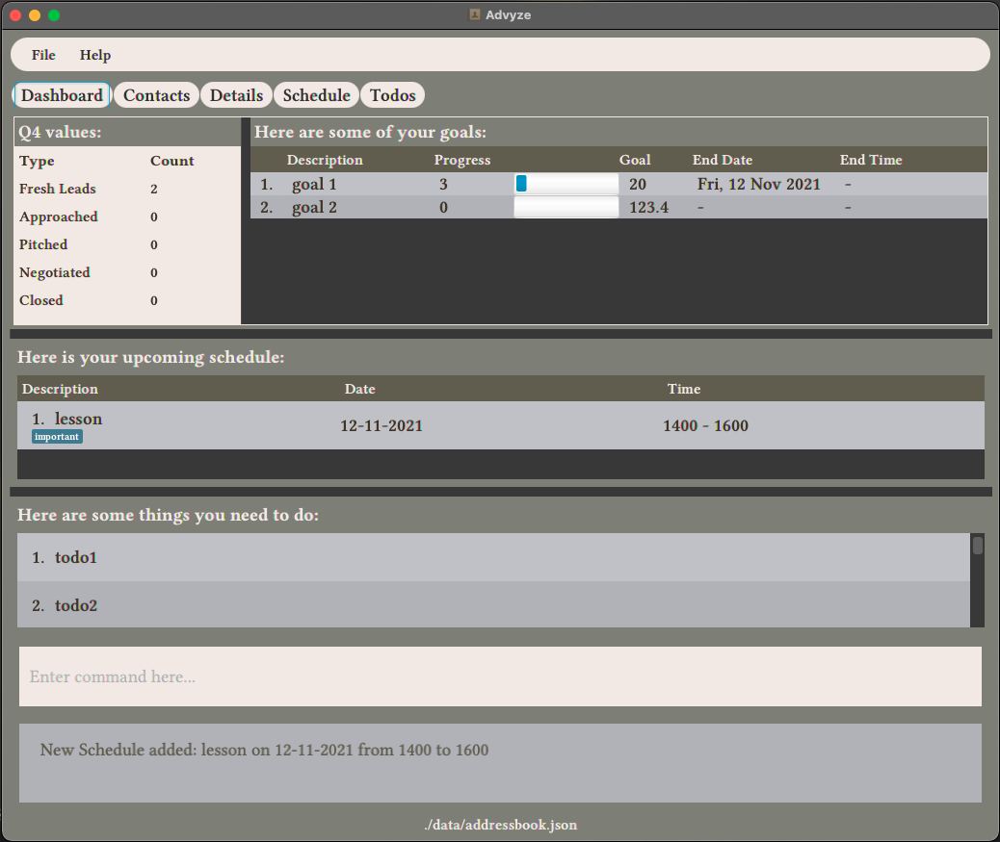

# Advyze
This is **a project by Software Engineering (SE) students** which is designed for tech-savvy student financial advisors who prefer CLI over GUI, and have a lot of clients and a busy school schedule to keep track of. 
## Example usages:
  * Keep track and manage client details
  * Keep track of all their tasks in a Todo List
  * Keep track of Scheduled Events like meetings and lessons
  * Manage priorities
  * Monitor individual goals and KPIs

## About
This project is an ongoing software project for a desktop application (called _Advyze_).
  * It is **written in OOP fashion**.
  * It comes with a **reasonable level of user and developer documentation**.
  * Do take a look at [this](docs/AboutUs.md) if you want to know more about us individually.
## Project page site
For the detailed documentation of this project, please visit **[here](https://ay2122s1-cs2103-t14-4.github.io/tp/)**.

## Acknowledgement
This project is built on AB3, which is a part of the se-education.org initiative. Please do look at the code in [se-education.org](https://se-education.org#https://se-education.org/#contributing) for more info.
