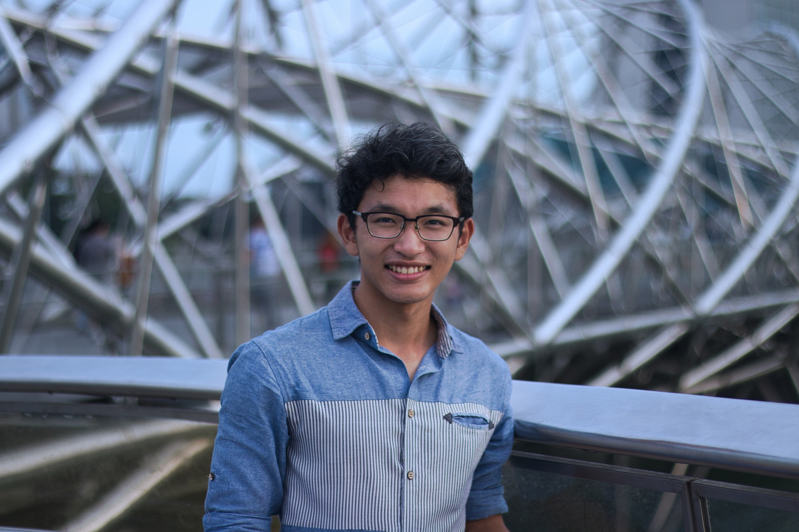
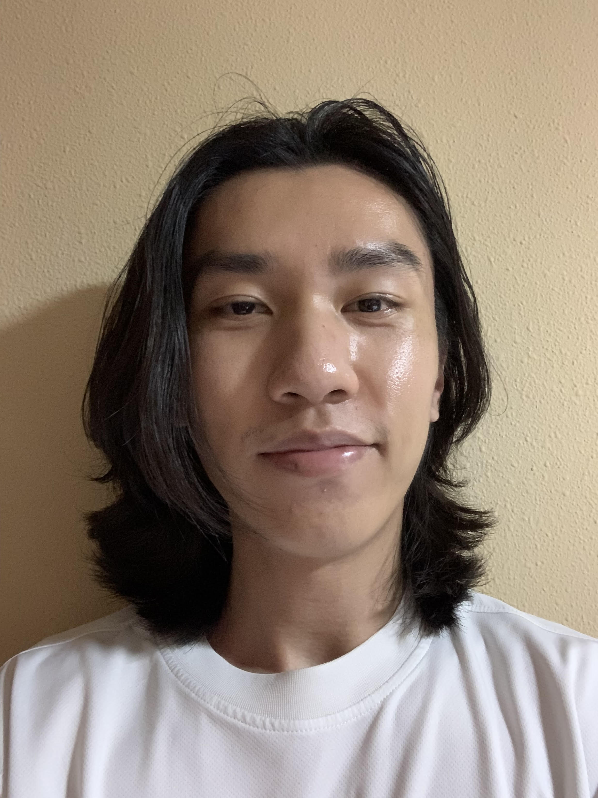
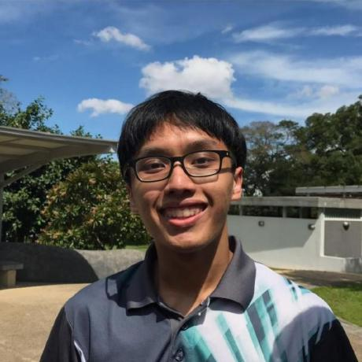

We are a team based in the [School of Computing, National University of Singapore](http://www.comp.nus.edu.sg).

You can reach us at the email `seer[at]comp.nus.edu.sg`

## Project team

### Ricky Andrew

[[github](https://github.com/rickyaandrew)]
[[portfolio](team/rickyaandrew.md)]

* Role: Developer
* Responsibilities: Debugging and Testing of Code

### Darren Mok

[[github](https://github.com/mokdarren)]
[[portfolio](team/mokdarren.md)]

* Role: Developer
* Responsibilities: Task scheduling, Contacts feature

### Justin Ngo

[[github](http://github.com/whoisjustinngo)]
[[portfolio](team/whoisjustinngo.md)]

* Role: Developer
* Responsibilities: UI, Documentation

### Kai Siang

[[github](https://github.com/kslui99)]
[[portfolio](team/kslui99.md)]

* Role: Developer
* Responsibilities: Logic, Code Quality

### Bryan Tee Pak Hong

[[github](https://github.com/SpdPnd98)]
[[portfolio](team/spdpnd98.md)]

* Role: Developer
* Responsibilities: Merge PRs

