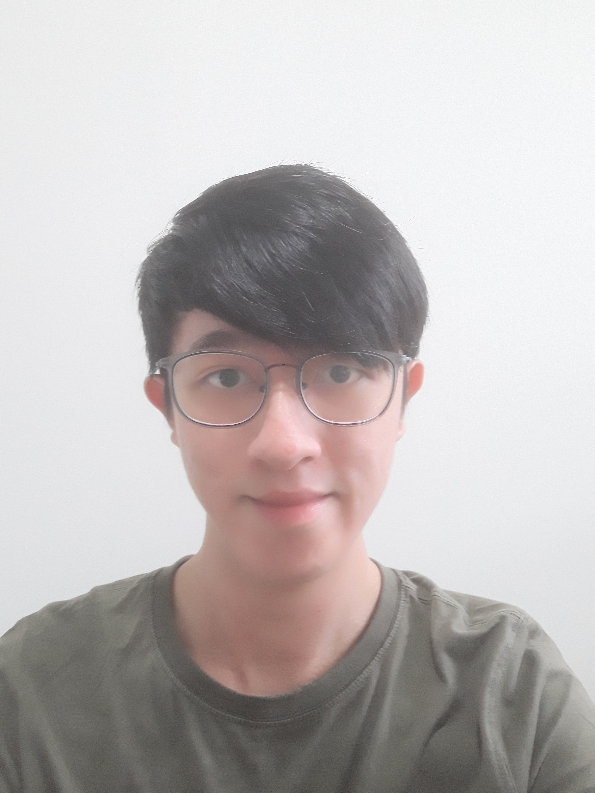
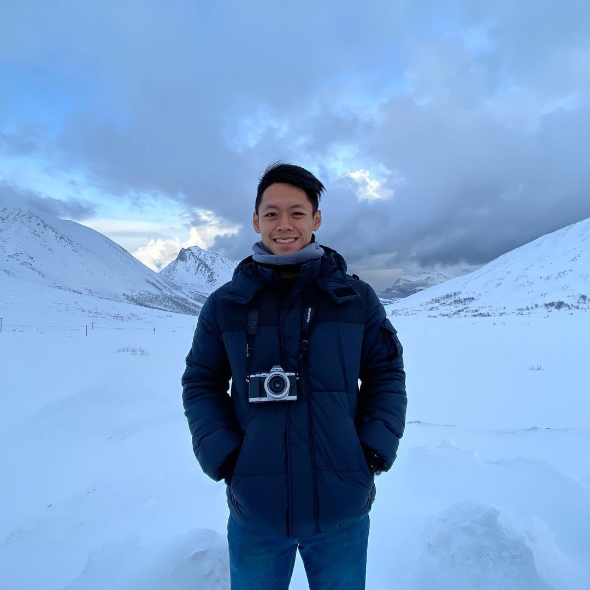

We are a team based in the [School of Computing, National University of Singapore](http://www.comp.nus.edu.sg).

You can reach us at the email `seer[at]comp.nus.edu.sg`

## Project team

### Kai Siang

[[github](https://github.com/kslui99)]
[[portfolio](team/kaisiang.md)]

* Role: Developer
* Responsibilities: Logic, Code Quality

### Darren Mok

[[github](https://github.com/mokdarren)]
[[portfolio](team/mokdarren.md)]

* Role: Developer
* Responsibilities: Task scheduling, Contacts feature

### Jane Doe

[[github](http://github.com/johndoe)]
[[portfolio](team/johndoe.md)]

* Role: Team Lead
* Responsibilities: UI

### Johnny Doe

[[github](http://github.com/johndoe)] [[portfolio](team/johndoe.md)]

* Role: Developer
* Responsibilities: Data

### Jean Doe

[[github](http://github.com/johndoe)]
[[portfolio](team/johndoe.md)]

* Role: Developer
* Responsibilities: Dev Ops + Threading

### Bryan Tee Pak Hong

[[github](https://github.com/SpdPnd98)]
[[portfolio](team/bryantee.md)]

* Role: Developer
* Responsibilities: UI
