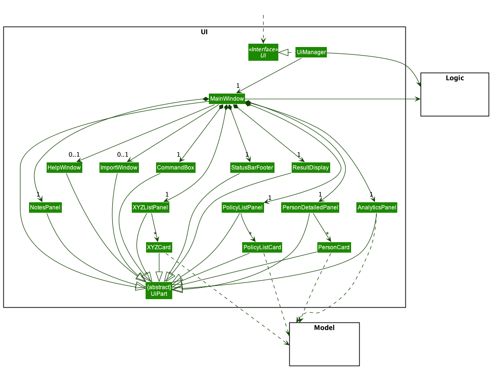
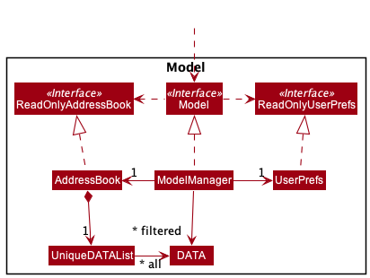
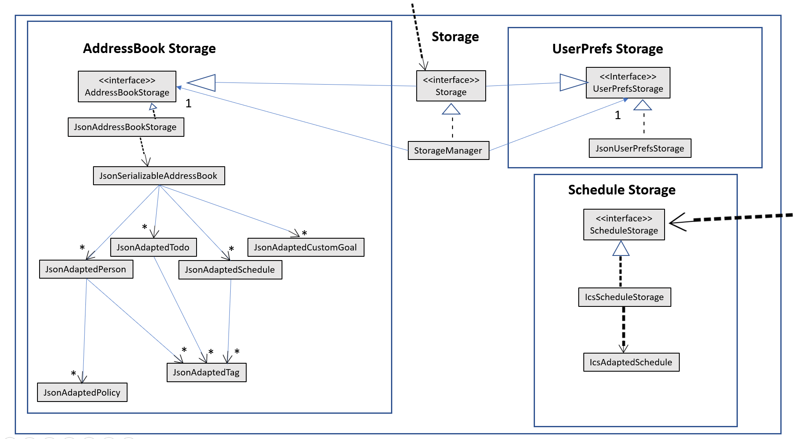

* Table of Contents
{:toc}

--------------------------------------------------------------------------------------------------------------------

## **Acknowledgements**

* {list here sources of all reused/adapted ideas, code, documentation, and third-party libraries -- include links to the original source as well}

--------------------------------------------------------------------------------------------------------------------

## **Setting up, getting started**

Refer to the guide [_Setting up and getting started_](SettingUp.md).

--------------------------------------------------------------------------------------------------------------------

## **Design**

:bulb: **Tip:** The `.puml` files used to create diagrams in this document can be found in the [diagrams](https://github.com/se-edu/addressbook-level3/tree/master/docs/diagrams/) folder. Refer to the [_PlantUML Tutorial_ at se-edu/guides](https://se-education.org/guides/tutorials/plantUml.html) to learn how to create and edit diagrams.

### Architecture

The ***Architecture Diagram*** given above explains the high-level design of the App.

Given below is a quick overview of main components and how they interact with each other.

**Main components of the architecture**

**`Main`** has two classes called [`Main`](https://github.com/se-edu/addressbook-level3/tree/master/src/main/java/seedu/address/Main.java) and [`MainApp`](https://github.com/se-edu/addressbook-level3/tree/master/src/main/java/seedu/address/MainApp.java). It is responsible for,
* At app launch: Initializes the components in the correct sequence, and connects them up with each other.
* At shut down: Shuts down the components and invokes cleanup methods where necessary.

[**`Commons`**](#common-classes) represents a collection of classes used by multiple other components.

The rest of the App consists of four components.

* [**`UI`**](#ui-component): The UI of the App.
* [**`Logic`**](#logic-component): The command executor.
* [**`Model`**](#model-component): Holds the data of the App in memory.
* [**`Storage`**](#storage-component): Reads data from, and writes data to, the hard disk.

**How the architecture components interact with each other**

The *Sequence Diagram* below shows how the components interact with each other for the scenario where the user issues the command `delete 1`.

Each of the four main components (also shown in the diagram above),

* defines its *API* in an `interface` with the same name as the Component.
* implements its functionality using a concrete `{Component Name}Manager` class (which follows the corresponding API `interface` mentioned in the previous point.

For example, the `Logic` component defines its API in the `Logic.java` interface and implements its functionality using the `LogicManager.java` class which follows the `Logic` interface. Other components interact with a given component through its interface rather than the concrete class (reason: to prevent outside component's being coupled to the implementation of a component), as illustrated in the (partial) class diagram below.

The sections below give more details of each component.

### UI component

The **API** of this component is specified in [`Ui.java`](https://github.com/se-edu/addressbook-level3/tree/master/src/main/java/seedu/address/ui/Ui.java)

The UI consists of a `MainWindow` that is made up of parts e.g.`CommandBox`, `ResultDisplay`, `PersonListPanel`, `StatusBarFooter` etc. All these, including the `MainWindow`, inherit from the abstract `UiPart` class which captures the commonalities between classes that represent parts of the visible GUI.

The `UI` component uses the JavaFx UI framework. The layout of these UI parts are defined in matching `.fxml` files that are in the `src/main/resources/view` folder. For example, the layout of the [`MainWindow`](https://github.com/se-edu/addressbook-level3/tree/master/src/main/java/seedu/address/ui/MainWindow.java) is specified in [`MainWindow.fxml`](https://github.com/se-edu/addressbook-level3/tree/master/src/main/resources/view/MainWindow.fxml)

The `UI` component,

* executes user commands using the `Logic` component.
* listens for changes to `Model` data so that the UI can be updated with the modified data.
* keeps a reference to the `Logic` component, because the `UI` relies on the `Logic` to execute commands.
* depends on some classes in the `Model` component, as it displays `Person` object residing in the `Model`.

### Logic component

**API** : [`Logic.java`](https://github.com/se-edu/addressbook-level3/tree/master/src/main/java/seedu/address/logic/Logic.java)

Here's a (partial) class diagram of the `Logic` component:

How the `Logic` component works:
1. When `Logic` is called upon to execute a command, it uses the `AddressBookParser` class to parse the user command.
1. This results in a `Command` object (more precisely, an object of one of its subclasses e.g., `AddCommand`) which is executed by the `LogicManager`.
1. The command can communicate with the `Model` when it is executed (e.g. to add a person).
1. The result of the command execution is encapsulated as a `CommandResult` object which is returned back from `Logic`.

The Sequence Diagram below illustrates the interactions within the `Logic` component for the `execute("delete 1")` API call.

:information_source: **Note:** The lifeline for `DeleteCommandParser` should end at the destroy marker (X) but due to a limitation of PlantUML, the lifeline reaches the end of diagram.

Here are the other classes in `Logic` (omitted from the class diagram above) that are used for parsing a user command:

How the parsing works:
* When called upon to parse a user command, the `AddressBookParser` class creates an `XYZCommandParser` (`XYZ` is a placeholder for the specific command name e.g., `AddCommandParser`) which uses the other classes shown above to parse the user command and create a `XYZCommand` object (e.g., `AddCommand`) which the `AddressBookParser` returns back as a `Command` object.
* All `XYZCommandParser` classes (e.g., `AddCommandParser`, `DeleteCommandParser`, ...) inherit from the `Parser` interface so that they can be treated similarly where possible e.g, during testing.

### Model component
**API** : [`Model.java`](https://github.com/se-edu/addressbook-level3/tree/master/src/main/java/seedu/address/model/Model.java)

The `Model` component,

* stores the address book data i.e., all `Person` objects (which are contained in a `UniquePersonList` object).
* stores the currently 'selected' `Person` objects (e.g., results of a search query) as a separate _filtered_ list which is exposed to outsiders as an unmodifiable `ObservableList<Person>` that can be 'observed' e.g. the UI can be bound to this list so that the UI automatically updates when the data in the list change.
* stores a `UserPref` object that represents the user’s preferences. This is exposed to the outside as a `ReadOnlyUserPref` objects.
* does not depend on any of the other three components (as the `Model` represents data entities of the domain, they should make sense on their own without depending on other components)

:information_source: **Note:** An alternative (arguably, a more OOP) model is given below. It has a `Tag` list in the `AddressBook`, which `Person` references. This allows `AddressBook` to only require one `Tag` object per unique tag, instead of each `Person` needing their own `Tag` objects. 

### Storage component

**API** : [`Storage.java`](https://github.com/se-edu/addressbook-level3/tree/master/src/main/java/seedu/address/storage/Storage.java)

The `Storage` component,
* can save both address book data and user preference data in json format, and read them back into corresponding objects.
* inherits from both `AddressBookStorage` and `UserPrefStorage`, which means it can be treated as either one (if only the functionality of only one is needed).
* depends on some classes in the `Model` component (because the `Storage` component's job is to save/retrieve objects that belong to the `Model`)

### Common classes

Classes used by multiple components are in the `seedu.addressbook.commons` package.

--------------------------------------------------------------------------------------------------------------------

## **Implementation**

This section describes some noteworthy details on how certain features are implemented.

### \[Proposed\] Undo/redo feature

#### Proposed Implementation

The proposed undo/redo mechanism is facilitated by `VersionedAddressBook`. It extends `AddressBook` with an undo/redo history, stored internally as an `addressBookStateList` and `currentStatePointer`. Additionally, it implements the following operations:

* `VersionedAddressBook#commit()` — Saves the current address book state in its history.
* `VersionedAddressBook#undo()` — Restores the previous address book state from its history.
* `VersionedAddressBook#redo()` — Restores a previously undone address book state from its history.

These operations are exposed in the `Model` interface as `Model#commitAddressBook()`, `Model#undoAddressBook()` and `Model#redoAddressBook()` respectively.

Given below is an example usage scenario and how the undo/redo mechanism behaves at each step.

Step 1. The user launches the application for the first time. The `VersionedAddressBook` will be initialized with the initial address book state, and the `currentStatePointer` pointing to that single address book state.

Step 2. The user executes `delete 5` command to delete the 5th person in the address book. The `delete` command calls `Model#commitAddressBook()`, causing the modified state of the address book after the `delete 5` command executes to be saved in the `addressBookStateList`, and the `currentStatePointer` is shifted to the newly inserted address book state.

Step 3. The user executes `add n/David …​` to add a new person. The `add` command also calls `Model#commitAddressBook()`, causing another modified address book state to be saved into the `addressBookStateList`.

:information_source: **Note:** If a command fails its execution, it will not call `Model#commitAddressBook()`, so the address book state will not be saved into the `addressBookStateList`.

Step 4. The user now decides that adding the person was a mistake, and decides to undo that action by executing the `undo` command. The `undo` command will call `Model#undoAddressBook()`, which will shift the `currentStatePointer` once to the left, pointing it to the previous address book state, and restores the address book to that state.

:information_source: **Note:** If the `currentStatePointer` is at index 0, pointing to the initial AddressBook state, then there are no previous AddressBook states to restore. The `undo` command uses `Model#canUndoAddressBook()` to check if this is the case. If so, it will return an error to the user rather
than attempting to perform the undo.

The following sequence diagram shows how the undo operation works:

:information_source: **Note:** The lifeline for `UndoCommand` should end at the destroy marker (X) but due to a limitation of PlantUML, the lifeline reaches the end of diagram.

The `redo` command does the opposite — it calls `Model#redoAddressBook()`, which shifts the `currentStatePointer` once to the right, pointing to the previously undone state, and restores the address book to that state.

:information_source: **Note:** If the `currentStatePointer` is at index `addressBookStateList.size() - 1`, pointing to the latest address book state, then there are no undone AddressBook states to restore. The `redo` command uses `Model#canRedoAddressBook()` to check if this is the case. If so, it will return an error to the user rather than attempting to perform the redo.

Step 5. The user then decides to execute the command `list`. Commands that do not modify the address book, such as `list`, will usually not call `Model#commitAddressBook()`, `Model#undoAddressBook()` or `Model#redoAddressBook()`. Thus, the `addressBookStateList` remains unchanged.

Step 6. The user executes `clear`, which calls `Model#commitAddressBook()`. Since the `currentStatePointer` is not pointing at the end of the `addressBookStateList`, all address book states after the `currentStatePointer` will be purged. Reason: It no longer makes sense to redo the `add n/David …​` command. This is the behavior that most modern desktop applications follow.

The following activity diagram summarizes what happens when a user executes a new command:

#### Design considerations:

**Aspect: How undo & redo executes:**

* **Alternative 1 (current choice):** Saves the entire address book.
  * Pros: Easy to implement.
  * Cons: May have performance issues in terms of memory usage.

* **Alternative 2:** Individual command knows how to undo/redo by
  itself.
  * Pros: Will use less memory (e.g. for `delete`, just save the person being deleted).
  * Cons: We must ensure that the implementation of each individual command are correct.

_{more aspects and alternatives to be added}_

### \[Proposed\] Data archiving

_{Explain here how the data archiving feature will be implemented}_

--------------------------------------------------------------------------------------------------------------------

## **Documentation, logging, testing, configuration, dev-ops**

* [Documentation guide](Documentation.md)
* [Testing guide](Testing.md)
* [Logging guide](Logging.md)
* [Configuration guide](Configuration.md)
* [DevOps guide](DevOps.md)

--------------------------------------------------------------------------------------------------------------------

## **Appendix: Requirements**

### Product scope

**Target user profile**:

* Students working part-time as financial advisors
  * Have a need to manage a significant number of contacts
  * Have a need to manage a busy schedule (both school and work)
  * Have a need to segregate work contacts and tasks from that of school when necessary
* Prefer desktop apps over other types and is reasonably comfortable using CLI apps
* Can type fast and prefers typing to mouse interactions

**Value proposition**:

* Helps target user keep track of their contacts
  * Includes contact's profile in addition to basic contact information – useful for managing client relationships
* Helps target user keep track of their schedule
  * Facilitates target user in de-conflicting potential client meetings with school timetable 
* Helps target user keep track of any ad-hoc tasks that can be completed anytime (ToDos) 
* Enables target user to rank and hence prioritise clients based on potential commissions
* Allows target user to set their personal KPI and subsequently monitor their progress

### User stories

Priorities: High (must have) - `* * *`, Medium (nice to have) - `* *`, Low (unlikely to have) - `*`

| Priority | As a …​                                 | I want to …​                                       | So that …​                                                          |
| -------- | ------------------------------------------ | ----------------------------------------------------- | ---------------------------------------------------------------------- |
| `* * *`  | student working as a financial advisor      | add new event to schedule                             | I can keep track of my client meetings, school commitments and other time-sensitive activities |
| `* * *`  | student working as a financial advisor      | view events in schedule                               | I can have a better understanding of my schedule |
| `* *`    | student working as a financial advisor      | edit an event in schedule                             | I can edit details of a previously added event |
| `* * *`  | student working as a financial advisor      | delete an event in schedule                           | I can delete a previously added event |
| `* * *`  | student working as a financial advisor      | add a new ToDo                                        | I can keep track of my things to do (i.e. tasks that can be completed any time) |
| `* * *`  | student working as a financial advisor      | view current ToDos                                    | I can see what I have left to do |
| `* *`    | student working as a financial advisor      | edit a previously added ToDo                          | I can edit details of a previously added todo |
| `* * *`  | student working as a financial advisor      | delete a previously added ToDo                        |  |
| `* * *`  | person juggling multiple responsibilities	| be able to sort my tasks based on how soon they are due | I know how I should assign my time |
| `*`      | student working as a financial advisor	    | toggle the schedule to show only either school or work related events | I can see how events in each category |
| `* *`    | user with a busy schedule	                | be able to set recurring tasks                        | I do not need to explicitly enter the same tasks one by one |
| `* *`    | user	                                    | easily re-add previously completed tasks	            | I do not need to type out all the details again | 
| `*`      | financial Advisor	                        | keep track of state of claims of clients and relevant tasks | I can manage claims of all clients effectively|
| `*`      | financial Advisor who wants to build a personal connection with my clients | I can see all upcoming important client-related events (such as birthdays) | remember to send greetings and congratulations to them |
| `*`      | user	                                    | set reminders for myself	                            | whenever I use the application I will be reminded on the important things which I need to do today |
| `* *`    | user who needs to schedule events          | view public holidays	                                | I am aware when I can/can't schedule a time to meet clients, as well as know when are the relevant school off-days |
| `*`      | expert user	                            | import school calendar automatically	                | I can schedule my school timetable automatically |
| `* * *`  | person juggling multiple responsibilities  | view dashboard to see events occurring today          | I have an idea of what my day would be like |
| `* * *`  | student working as a financial advisor      | add a new contact                                     | I can keep track of all my contacts |
| `* * *`  | student working as a financial advisor      | view all contacts                                     |  |
| `* *`    | student working as a financial advisor      | update details of a previously added contact          |  | 
| `* * *`  | student working as a financial advisor      | delete an existing contact                            |  |
| `* * *`  | financial Advisor who wants to build a personal connection with my clients | maintain a detailed profile of the client which includes their birthday, email, current financial plans, job, age, monthly income etc. | I can understand my clients on a more personal level |
| `* * *`  | financial Advisor who wants to decide which client to meet next | be able to tag clients based on their status (fresh, closing, closed)	| I can make informed decisions about when prioritising clients in order to maximize my earnings |
| `* *`    | financial advisor	                        | delete multiple clients from my contact book in a single command | it is more convenient |
| `* *`    | user                                       | filter based on attributes of each contact	            | I can view different groups of contacts separately |
| `* *`    | financial advisor	                        | keep track of the minutes of the meetings with each client | I have a record of what was discussed |
| `* *`    | financial advisor	                        | sort potential leads by probability of conversion	    | I can prioritise which clients to meet |
| `* *`    | expert user	                            | sort clients based on value of lead or urgency	    | I can effectively prioritise work schedule to maximise performance |
| `*`      | user 	                                    | be able to see how much time I have spent in each category of my responsibilities (e.g. work, school, personal) | I can try to have a better work-school-life balance |
| `* *`    | user                                       | set my targets and goals                              | I know what I am working towards |
| `* *`    | user                                       | view my targets and goals                             | | 
| `* *`    | user                                       | edit my current targets and goals                     | I can update my progress or change my previously set goals / targets |
| `* *`    | user                                       | delete a previously set target                        | |
| `* * *`  | user	                                    | import / export all of my data	                    | I am able to transfer my data to another device / back up my data |
| `* * *`  | financial advisor getting ready to add new client data from an Excel file to what I currently have | import data from an Excel spreadsheet | I can add all current clients I have without spending time to input the data row-by-row |
| `* * *`  | careful user who is afraid of all my data being locked in the app | export all data onto an Excel spreadsheet or pdf | I can have access to my data in a familiar format that I can read and edit |
| `*`      | potential user exploring Advyze	        | link Advyze to third party email applications interfaces | I can seamlessly send and/or receive emails through Advyze |
| `*`      | financial advisor	                        | hide student features                                 | I will not mixed up between features for students and financial advisor when I do not need them |
| `* * *`  | student working as a financial advisor      | add tags to data                                      | I can see which contacts / tasks are school related and which are work related |
| `* *`    | user                                       | delete data according to tags	                        | I can clear all data in a category easily |
| `*`      | user	                                    | have a quick reference available on my mobile phone	| I do not need to keep referring to my computer or carry my computer everywhere |
| `* *`    | user                                       | set item priority	                                    | I will know which actions, tasks, or clients I need to prioritise |
| `* *`    | potential user exploring Advyze            | see the app populated with sample data	            | I can see how the app will look like when it is in use |
| `* *`    | beginner user	                            | be introduced to key features of Advyze	            | I can start to maximise the potential of Advyze |
| `* * *`  | user	                                    | have keyboard commands to switch tabs	                | I can see different tabs |

### Use cases

> **Use case 01: Adding a new contact**

**Actor**: User

**MSS**

1. User specifies details of the contact to add
2. Advyze adds the contact  
Use case ends

**Extensions**

* 2a. The given details of the contact is a duplicate (same name and phone number)
  * 2a1. Advyze prompts the user for a confirmation to overwrite the existing contact
    * 2a1a. User accepts confirmation to overwrite
    * 2a1b. User declines confirmation to overwrite
  * Use case ends
* 3a. The given details are invalid (e.g. missing details, invalid format)
  * 3a1. Advyze shows an error message
  * Use case ends
 
> **Use case 02: Deleting an event**

**Actor**: User

**MSS**

1. User requests to list all events
2. Advyze shows a list of events
3. User requests to delete a specific event in the list
4. Advyze deletes the event  
   Use case ends

**Extensions**

* 2a. The list of events is empty
    * Use case ends
* 3a. The given index of the event to delete is invalid (e.g. index specified doesn't exist or no index specified)
    * 3a1. Advyze shows an error message
    * Use case ends

> **Use case 03: Switching between tabs**
 
**Actor**: User

**MSS**

1. User specifies tab to switch to
2. Advyze switches to the specified tab  
   Use case ends

**Extensions**

* 1a. Tab specified by the user does not exist
  * Advyze displays an error message
  * Use case ends

### Non-Functional Requirements

1. Should work on any mainstream OS that has Java 11 or above installed.
2. Should be able to hold up to 1000 persons without a noticeable sluggishness in performance with typical usage.
3. A user with above average typing speed for regular English text (i.e. not code, not system admin commands) should be able to make use of the app faster by typing the commands than using the mouse.
4. Should work without internet connection.
5. The application should not take more than 200 man-hours to develop.
6. Should be usable by a novice without any programming experience after they read the User Guide.
7. The project is expected to adhere to a schedule that delivers feature sets in two iterations.

### Glossary

* **Tab:** Refers to a logical section of the app which provides certain functionalities. For example, the Dashboard tab contains all functionalities for the dashboard.
* **Dashboard:** a tab that aggregates relevant information for convenient and quick viewing
* **Contacts:** a tab where information on the user’s contacts are displayed
* **Schedule:** a tab where the user’s events are displayed
  * **Event:** a task that is tied to a timeline, for example Lessons, Deadlines or Meetings.
* **Todos (tab):** a tab where the user’s todos are displayed
  * **Todo (task):** a task that does not have a time

--------------------------------------------------------------------------------------------------------------------

## **Appendix: Instructions for manual testing**

Given below are instructions to test the app manually.

:information_source: **Note:** These instructions only provide a starting point for testers to work on;
testers are expected to do more *exploratory* testing.

### Launch and shutdown

1. Initial launch

   1. Download the jar file and copy into an empty folder

   1. Double-click the jar file Expected: Shows the GUI with a set of sample contacts. The window size may not be optimum.

1. Saving window preferences

   1. Resize the window to an optimum size. Move the window to a different location. Close the window.

   1. Re-launch the app by double-clicking the jar file. 
       Expected: The most recent window size and location is retained.

1. _{ more test cases …​ }_

### Deleting a person

1. Deleting a person while all persons are being shown

   1. Prerequisites: List all persons using the `list` command. Multiple persons in the list.

   1. Test case: `delete 1` 
      Expected: First contact is deleted from the list. Details of the deleted contact shown in the status message. Timestamp in the status bar is updated.

   1. Test case: `delete 0` 
      Expected: No person is deleted. Error details shown in the status message. Status bar remains the same.

   1. Other incorrect delete commands to try: `delete`, `delete x`, `...` (where x is larger than the list size) 
      Expected: Similar to previous.

1. _{ more test cases …​ }_

### Saving data

1. Dealing with missing/corrupted data files

   1. _{explain how to simulate a missing/corrupted file, and the expected behavior}_

1. _{ more test cases …​ }_
