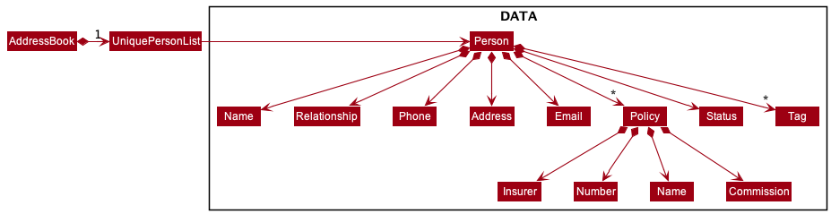

* Table of Contents
{:toc}

--------------------------------------------------------------------------------------------------------------------

## **Acknowledgements**

* Advyze is built by using the [AddressBook Level 3 project template](https://github.com/se-edu/addressbook-level3) from [SE-EDU](https://se-education.org/).
* Third-party libraries used: [iCal4j](https://github.com/ical4j/ical4j)

--------------------------------------------------------------------------------------------------------------------

## **Setting up, getting started**

Refer to the guide [_Setting up and getting started_](SettingUp.md).

--------------------------------------------------------------------------------------------------------------------

## **Design**

<div markdown="span" class="alert alert-primary">

:bulb: **Tip:** The `.puml` files used to create diagrams in this document can be found in the [diagrams](https://github.com/se-edu/addressbook-level3/tree/master/docs/diagrams/) folder. Refer to the [_PlantUML Tutorial_ at se-edu/guides](https://se-education.org/guides/tutorials/plantUml.html) to learn how to create and edit diagrams.
</div>

### Architecture


The ***Architecture Diagram*** given above explains the high-level design of the App.

Given below is a quick overview of main components and how they interact with each other.

**Main components of the architecture**

**`Main`** has two classes called [`Main`](https://github.com/se-edu/addressbook-level3/tree/master/src/main/java/seedu/address/Main.java) and [`MainApp`](https://github.com/se-edu/addressbook-level3/tree/master/src/main/java/seedu/address/MainApp.java). It is responsible for,
* At app launch: Initializes the components in the correct sequence, and connects them up with each other.
* At shut down: Shuts down the components and invokes cleanup methods where necessary.

[**`Commons`**](#common-classes) represents a collection of classes used by multiple other components.

The rest of the App consists of four components.

* [**`UI`**](#ui-component): The UI of the App.
* [**`Logic`**](#logic-component): The command executor.
* [**`Model`**](#model-component): Holds the data of the App in memory.
* [**`Storage`**](#storage-component): Reads data from, and writes data to, the hard disk.


**How the architecture components interact with each other**

The *Sequence Diagram* below shows how the components interact with each other for the scenario where the user issues the command `delete 1` while he is on the Contacts tab.


Each of the four main components (also shown in the diagram above),

* defines its *API* in an `interface` with the same name as the Component.
* implements its functionality using a concrete `{Component Name}Manager` class (which follows the corresponding API `interface` mentioned in the previous point.

For example, the `Logic` component defines its API in the `Logic.java` interface and implements its functionality using the `LogicManager.java` class which follows the `Logic` interface. Other components interact with a given component through its interface rather than the concrete class (reason: to prevent outside components being coupled to the implementation of a component), as illustrated in the (partial) class diagram below.


The sections below give more details of each component.

### UI component

The **API** of this component is specified in [`Ui.java`](https://github.com/se-edu/addressbook-level3/tree/master/src/main/java/seedu/address/ui/Ui.java)


The UI consists of a `MainWindow` that is made up of parts e.g.`CommandBox`, `ResultDisplay`, `PersonListPanel`, `StatusBarFooter` etc. All these, including the `MainWindow`, inherit from the abstract `UiPart` class which captures the commonalities between classes that represent parts of the visible GUI.

The `UI` component uses the JavaFx UI framework. The layout of these UI parts are defined in matching `.fxml` files that are in the `src/main/resources/view` folder. For example, the layout of the [`MainWindow`](https://github.com/se-edu/addressbook-level3/tree/master/src/main/java/seedu/address/ui/MainWindow.java) is specified in [`MainWindow.fxml`](https://github.com/se-edu/addressbook-level3/tree/master/src/main/resources/view/MainWindow.fxml)

The `UI` component,

* executes user commands using the `Logic` component.
* listens for changes to `Model` data so that the UI can be updated with the modified data.
* keeps a reference to the `Logic` component, because the `UI` relies on the `Logic` to execute commands.
* depends on some classes in the `Model` component, as it displays `Person` object residing in the `Model`.

### Logic component

**API** : [`Logic.java`](https://github.com/se-edu/addressbook-level3/tree/master/src/main/java/seedu/address/logic/Logic.java)

Here's a (partial) class diagram of the `Logic` component:


How the `Logic` component works:
1. When `Logic` is called upon to execute a command, it uses the `AddressBookParser` class to parse the user command.
1. This results in a `Command` object (more precisely, an object of one of its subclasses e.g., `AddCommand`) which is executed by the `LogicManager`.
1. The command can communicate with the `Model` when it is executed (e.g. to add a person).
1. The result of the command execution is encapsulated as a `CommandResult` object which is returned back from `Logic`.

The Sequence Diagram below illustrates the interactions within the `Logic` component for the `execute("delete 1")` API call.


<div markdown="span" class="alert alert-info">:information_source: **Note:** The lifeline for `DeleteCommandParser` should end at the destroy marker (X) but due to a limitation of PlantUML, the lifeline reaches the end of diagram.
</div>

Here are the other classes in `Logic` (omitted from the class diagram above) that are used for parsing a user command:


How the parsing works:
* When called upon to parse a user command, the `AddressBookParser` class creates an `XYZCommandParser` (`XYZ` is a placeholder for the specific command name e.g., `AddCommandParser`) which uses the other classes shown above to parse the user command and create a `XYZCommand` object (e.g., `AddCommand`) which the `AddressBookParser` returns back as a `Command` object.
* All `XYZCommandParser` classes (e.g., `AddCommandParser`, `DeleteCommandParser`, ...) inherit from the `Parser` interface so that they can be treated similarly where possible e.g, during testing.

### Model component
**API** : [`Model.java`](https://github.com/se-edu/addressbook-level3/tree/master/src/main/java/seedu/address/model/Model.java)


The `Model` component,

* stores the address book data
  * all `Person` objects (which are contained in a `UniquePersonList` object)
  * all `Todo` objects (which are contained in a `UniqueTodoList` object)
  * all `CustomGoal` objects (which are contained in a `UniqueCustomGoalList` object)
  * all `Schedule` objects (which are contained in a `UniqueScheduleList` object)
  * For the sake of brevity, let's call such objects we are using to store data `DATA` objects
* stores the currently 'selected' `DATA` objects (e.g., results of a search query) as a separate _filtered_ list which is exposed to outsiders as an unmodifiable `ObservableList<DATA>` that can be 'observed' e.g. the UI can be bound to this list so that the UI automatically updates when the data in the list change.
* stores a `UserPref` object that represents the user’s preferences. This is exposed to the outside as a `ReadOnlyUserPref` objects.
* does not depend on any of the other three components (as the `Model` represents data entities of the domain, they should make sense on their own without depending on other components)


:bulb: Each `Person` object can store client related information such as `Status`, `Policies` and notes as a `String` 


<div markdown="span" class="alert alert-info">
:information_source: **Note:** A more detailed model on each DATA object is given below.  
  
`Person` objects:  
  
  
`Schedule`, `Todo`, `CustomGoal` objects:

</div>


### Storage component

**API** : [`Storage.java`](https://github.com/se-edu/addressbook-level3/tree/master/src/main/java/seedu/address/storage/Storage.java)


The `Storage` component,
* can save both address book data and user preference data in json format, and read them back into corresponding objects.
* inherits from both `AddressBookStorage` and `UserPrefStorage`, which means it can be treated as either one (if only the functionality of only one is needed).
* depends on some classes in the `Model` component (because the `Storage` component's job is to save/retrieve objects that belong to the `Model`)

### Common classes

Classes used by multiple components are in the `seedu.addressbook.commons` package.

--------------------------------------------------------------------------------------------------------------------

## **Implementation**

This section describes some noteworthy details on how certain features are implemented.
###\[Proposed for v1.3\] Filter `Persons`

#### Implementation

The `ModelManager` manages all in-memory data which allows us to easily parse in a `Predicate` to filter Persons based
on a `Person's` atrribute. To allow the user to filter for any attribute of a `Person`, a `Predicate` class is created
for each attribute.

A `Predicate` takes in a keyword which applies a filter onto the model.
Some examples are: `AddressContainsKeywordsPredicate`, `EmailContainsKeywordsPredicate`, .. etc
#### Design considerations
Since the architecture follows a Model-view-controller design pattern, we have `FilteredList<Person>` wrapping an `ObservableList<Person>`
which is used to keep store in-memory data of `Person` objects. Our UI Views constantly listens for changes triggered by
`FilterCommand#execute` which updates the `FilteredList<Person>` with a new predicate which then reflects an updated view
on the UI of the filtered persons. This design provides a clean way for us to filter data using `Predicate`s.

### \[Proposed for v1.2\] Scheduling an Event

#### Proposed implementation

The proposed feature of scheduling is parsed by `AddScheduleCommandParser`, and implemented by the `AddScheduleCommand`, where it will add the given Event into the list of Events that the user have. While adding a new `Event` into the `Schedule`, it will help to check if the given `Event` clashes with the Events which are already added into the `Schedule`. 

On top of that, `Schedule` will all be arranged in the order starting from the earliest `Event` to the latest available `Event` with the aid of the `Comparator<Schedule>` which is declared in `UniqueScheduleList`.

#### Design considerations

**Aspect: How add schedule executes:**
* **Alternative 1 (current choice) Add Schedule into one UnqiueScheduleList**
    * Pros: All the schedules are added into a list, and it is easier to navigate. It also makes the code looks cleaner and easier to understand as well.
    * Cons: Iteration will always be O(n) since sorting and checking if there are clashes in `Schedule` happens in this `UniqueScheduleList`
* **Alternative 2 use HashMap<Date, ScheduleList>**
    * Pros: Operation does not need to take O(n) time when it comes to checking if the `Event` clashes, since we only check if there are clashes on that particular given date.
    * Cons: Decreases overall code consistency.

### \[Proposed for v1.3\] Display analytics on the Dashboard tab to facilitate goal setting

A large portion of the income of financial advisors is from the commissions they earn from closing sales. This makes having
personal goals an integral part of their workflow, as they need to know what they are working towards at the end of the day, 
and how far they have left to go. Apart from being able to set their own ad hoc goals (feature coming soon), the dashboard
will display general analytics so that the user can monitor their progress. Some fields that will be (tentatively) tracked are:
* Total Commission Earned This Month
* Total Number of Fresh Contacts this month
* Total Number of Closing Contacts
* Total Number of Closed Contacts This Month
* Pending Claims
* Contacts moved from fresh to closing to closed
Note that there is no goal setting here, just monitoring of various statistics.

#### Proposed Implementation
The fields related to status of contacts will track changes in the contacts tab. For example for the number of fresh contacts
this month, whenever the user adds a new contact with the `client` tag, the relevant section on the dashboard notices this 
and increments the count by 1. When it is detected that a new month has begun (from reading system time), the count 
would be reset.

Integrating contacts and dashboard this way would reduce the amount of work the user needs to do.

That being said, some fields like the total commission earned this month will have to be input manually.

### \[Proposed for v1.3\] Import .ics Schedules
For student financial advisors, they might have a portal that can generate calendar files that can be imported into google calendar,
such as NUSMods. NUSMods has a download `.ics` button that generates a `.ics` file for the users. These fields can be programmatically 
added into Advyze.

The basic structure of an `.ics` file is as follows
```
BEGIN VCALENDAR
VERSION:2.0
PRODID:-//NUSMods//NUSMods//EN
BEGIN VEVENT
DTSTAMP:20211027T064817Z
DTSTART:20211123T090000Z
DTEND:20211123T110000Z
SUMMARY:CS2103 Exam
...
END VEVENT
BEGIN VEVENT
...
END VEVENT
END VCALENDAR
```

For more details, look up the definition of fields of `.ics` files at [RFC2445](http://www.faqs.org/rfcs/rfc2445.html).

#### Proposed Implementation
As a start, implement a minimal version that includes the above visible fields.
- `VEVENT`
  - `DTSTART`
  - `DTEND`
  - `SUMMARY`
  - `RRULE`
- `VCALENDAR`

Each `VEVENT` will be represented as a `Schedule`, and each recurrence specified (if applicable) in `RRULE` are independent 
`Schedules` with different start and end times. The import will not be made if there are exceptions thrown in the process of 
parsing errors or fails during verification of whether the schedule has conflicts. If clashes exist, users will be prompted
the message when they add one single schedule, and no imports will be made. This is to facilitate manual conflict resolution
by the user, where the user will attempt to find which event has error on their own and keep tying to import until it is successful.

&nbsp;

### \[Proposed for v1.3\] Finding and Editing existing Events

#### Proposed implementation

The proposed feature of finding and editing the existing `Events` is being parsed by `FindScheduleCommandParser` and `EditScheduleCommandParser` respectively. Once parsed, those command will be implemented by the `FindScheduleCommand` and `EditScheduleCommand` respectively. 

For `FindScheduleCommand` a `Predicate` will takes in the keywords that is given by the user, then it will search through the `UniqueScheduleList`, checking if there are any `Events` which have the same keywords in description. Once done, it will return a `List` of all the `Events` which have the same keywords as the one given by the user, listing on the user interface.

For `EditScheduleCommand` user will need to input the index of the `Event` which will be editted, then key in only the interested field which the user would like to edit. Once completed, the old `Event` will be replaced with the new `Event` with the updated information.  

**Aspect on how finding an event is done**
  * Using a `Predicate` to get a `true false` return to check if the keywords are present in the description. If it is present, then it will be displayed. Otherwise, it will not be displayed. 

### \[Proposed for v1.3\] Including Tags in Events

The proposed feature is to add tags in the `Events` which is going to be added or `Events` which are already existed in the `UniqueScheduleList`. Tags are added so as to categorise different `Events` and also allows user to easily `Fitler` out `Events` that carries the same tags.

**Aspect on how tagging is done**
 * In each `Event`, there is a `List<Tag>` which carries all the `Tag` which the user have the `Event` tied to. All the `Tags` which are present in this `List<Tag>` will be displayed in the user interface as well. 

### \[Proposed for v1.3\] Filtering Events

Filtering an `Event` is similar to finding an `Event`. It is being parsed by the `FilterScheduleCommandParser` and filtering is being implemented by the `FilterScheduleCommand`. The parser will utilise a `Predicate` to filter the `UniqueScheduleList` based on any attribute which the user would like to filter on the `Event`. The `Predicate` takes in keyword of the respective attribute, and applied a filter onto the `UniqueScheduleList`. Only the `Event` which satisfies the `Predicate` will be displayed in the user interface.

**Aspect on how filtering is done**
`UniqueScheduleList` is used to keep store in-memory data which wraps an `ObservableList<Schedule>`. It is then fed to the Ui to display the filtered `Event` to the user. This design provides a clean way for us to filter data using Predicate.

### \[Proposed for v1.3\] Adding Recurring Events

Adding recurring `Event` is an enhancement in adding an `Event` into the `Schedule`. It allows user to add daily, weekly or yearly `Event` in a command line. 

Once a date is given to recur daily, weekly or yearly, it will first check for any clashes found if all the `Event` is added into the `Schedule`. If there are no clashes, all the `Events`, till the recur date, will be added, otherwise none will be added.

**Aspect on how recurring of Event is done**

 * This is done implementing another attribute for the `Event`, which is the recurring date. If the recurring date is present, then `Event` is a recurring `Event` otherwise it need not recur. Another attribute called `recurType` will determine if it recurs daily (D), weekly (W) or yearly (Y). `Event` will recur until it reaches the recur date.

### \[Proposed for v1.3\] Viewing only past or future Events

In the event when user only want to look at he past Events, user will be able to do so using the command line `showpast`. This command line helps to retrieve only those Events which have already in the past (comparing to today's date). 

For future Events, user is able to key in the command line `showupcoming`. This command line will help user to filter out and display those Events which are upcoming. All dates here are compared to the current date.

**Aspect on how viewing only past Events is done**

Both `showpast` and `showupcoming` is done by passing down a `Predicate` into a function which is available in `Model`. This function `Model#updateFilteredScheduleList()` will then filter out and show all the events which satisfies the `Predicate` given. In the event when `Predicate` is not satisfied by the Event, the Event will not be displayed.

### Mark `Todo` as done

#### Implementation

Marking a `Todo` as done is implemented as a `DoneTodoCommand`, which is similar in many ways with an `EditTodoCommand`. This similarity lies in the fact that both commands alter an attribute of the `Todo` model: the `EditTodoCommand` alters the description attribute of the `Todo`, while the `DoneTodoCommand` alters the `isDone` attribute of the `Todo`.

Since `Todos` are guaranteed to be immutable in the current implementation of the `Todo` model, the `DoneTodoCommand` applied to a `Todo` will not edit the `Todo`. Instead, a new `Todo` will be created with the same `description` but with the `isDone` attribute toggled to `true`.

#### Design considerations

**Aspect: How mark as done executes:**

* **Alternative 1 (current choice):** Replaces the current `Todo` with a new instance of `Todo`.
    * Pros: Consistent with the current implementation of the commands for editing a model, and thus increases consistency across the entire codebase.
    * Cons: May take up more computational resources since a new `Todo` is created every time it is marked as done. Nevertheless, the impact of this implementation on memory space is expected to be negligible, given that Java's garbage collection mechanism will automatically remove the de-referenced Todo.

* **Alternative 2:** Edits the current instance of `Todo`.
    * Pros: Might be faster and less wasteful, since there is no need to create a new `Todo` instance.
    * Cons: Decreased consistency across the codebase, and no longer guarantees that `Todo`s are immutable.

### \[Proposed for v1.3\] Convenience Commands

For v1.2, users have to go to a specific tab in order to run commands from said tab. To allow quality of life upgrades, users can add
a tab name to indicate which tab it runs in. However, to give the users visual feedback, we need to switch to the tab the command was intended for.

#### Proposed Implementation
To reasonably realise this, the original AB3 needs to be reconfigured to EITHER:
1. recognize it is running at a different tab, and set `tabswitch` to be true in `CommandResult`, alongside the actual `TAB_NAME` OR
2. always run `tab [TAB NAME]` as the first command, and then runs the user's command

Both of these implementations require major overhauls, but the latter requires a much smaller one, namely modifying
how to `execute` 2 commands. To achieve this, instead of returning a `Command`, return a `List<Command>` and execute all of the Commands.

However, we only need to return the last `CommandResult` as that is what the user entered. Therefore, we always assign the last `CommandResult` to 
show feedback to user.

### \[Proposed\] Undo/redo feature

#### Proposed Implementation

The proposed undo/redo mechanism is facilitated by `VersionedAddressBook`. It extends `AddressBook` with an undo/redo history, stored internally as an `addressBookStateList` and `currentStatePointer`. Additionally, it implements the following operations:

* `VersionedAddressBook#commit()` — Saves the current address book state in its history.
* `VersionedAddressBook#undo()` — Restores the previous address book state from its history.
* `VersionedAddressBook#redo()` — Restores a previously undone address book state from its history.

These operations are exposed in the `Model` interface as `Model#commitAddressBook()`, `Model#undoAddressBook()` and `Model#redoAddressBook()` respectively.

Given below is an example usage scenario and how the undo/redo mechanism behaves at each step.

Step 1. The user launches the application for the first time. The `VersionedAddressBook` will be initialized with the initial address book state, and the `currentStatePointer` pointing to that single address book state.


Step 2. The user executes `delete 5` command while he is on the Contacts tab to delete the 5th person in the address book. The `delete` command calls `Model#commitAddressBook()`, causing the modified state of the address book after the `delete 5` command executes to be saved in the `addressBookStateList`, and the `currentStatePointer` is shifted to the newly inserted address book state.


Step 3. The user executes `add n/David …​` while he is on the Contacts tab to add a new person. The `add` command also calls `Model#commitAddressBook()`, causing another modified address book state to be saved into the `addressBookStateList`.


<div markdown="span" class="alert alert-info">:information_source: **Note:** If a command fails its execution, it will not call `Model#commitAddressBook()`, so the address book state will not be saved into the `addressBookStateList`.

</div>

Step 4. The user now decides that adding the person was a mistake, and decides to undo that action by executing the `undo` command. The `undo` command will call `Model#undoAddressBook()`, which will shift the `currentStatePointer` once to the left, pointing it to the previous address book state, and restores the address book to that state.


<div markdown="span" class="alert alert-info">:information_source: **Note:** If the `currentStatePointer` is at index 0, pointing to the initial AddressBook state, then there are no previous AddressBook states to restore. The `undo` command uses `Model#canUndoAddressBook()` to check if this is the case. If so, it will return an error to the user rather
than attempting to perform the undo.

</div>

The following sequence diagram shows how the undo operation works:


<div markdown="span" class="alert alert-info">:information_source: **Note:** The lifeline for `UndoCommand` should end at the destroy marker (X) but due to a limitation of PlantUML, the lifeline reaches the end of diagram.

</div>

The `redo` command does the opposite — it calls `Model#redoAddressBook()`, which shifts the `currentStatePointer` once to the right, pointing to the previously undone state, and restores the address book to that state.

<div markdown="span" class="alert alert-info">:information_source: **Note:** If the `currentStatePointer` is at index `addressBookStateList.size() - 1`, pointing to the latest address book state, then there are no undone AddressBook states to restore. The `redo` command uses `Model#canRedoAddressBook()` to check if this is the case. If so, it will return an error to the user rather than attempting to perform the redo.

</div>

Step 5. The user then decides to execute the command `list` while he is on the Contacts tab. Commands that do not modify the address book, such as `list`, will usually not call `Model#commitAddressBook()`, `Model#undoAddressBook()` or `Model#redoAddressBook()`. Thus, the `addressBookStateList` remains unchanged.


The following activity diagram summarizes what happens when a user executes a new command:


#### Design considerations

**Aspect: How undo & redo executes:**

* **Alternative 1 (current choice):** Saves the entire address book.
    * Pros: Easy to implement.
    * Cons: May have performance issues in terms of memory usage.

* **Alternative 2:** Individual command knows how to undo/redo by
  itself.
    * Pros: Will use less memory (e.g. for `delete`, just save the person being deleted).
    * Cons: We must ensure that the implementation of each individual command are correct.

--------------------------------------------------------------------------------------------------------------------

## **Documentation, logging, testing, configuration, dev-ops**

* [Documentation guide](Documentation.md)
* [Testing guide](Testing.md)
* [Logging guide](Logging.md)
* [Configuration guide](Configuration.md)
* [DevOps guide](DevOps.md)

--------------------------------------------------------------------------------------------------------------------

## **Appendix: Requirements**

### Product scope

**Target user profile**:

* Students working part-time as financial advisors
  * Have a need to manage a significant number of contacts
  * Have a need to manage a busy schedule (both school and work)
  * Have a need to manage both school and work tasks
  * Have a need to segregate work contacts and tasks from that of school when necessary
* Prefer desktop apps over other types and is reasonably comfortable using CLI apps
* Can type fast and prefers typing to mouse interactions

**Value proposition**:

* Helps target user keep track of their contacts
  * Includes contact's profile in addition to basic contact information – useful for managing client relationships
* Helps target user keep track of their schedule
  * Facilitates target user in de-conflicting potential client meetings with school timetable 
* Helps target user keep track of any ad-hoc tasks that can be completed anytime (Todos) 
* Allows target user to set their personal goals and subsequently monitor their progress
* Manages contacts, schedule, todos, goals faster than a typical mouse/GUI-driven app

### User stories

Priorities: High (must have) - `* * *`, Medium (nice to have) - `* *`, Low (unlikely to have) - `*`

| Priority | As a …​                                 | I can …​                                       | So that …​                                                          |
| -------- | ------------------------------------------ | ----------------------------------------------------- | ---------------------------------------------------------------------- |
| `* * *`  | student working as a financial advisor      | add new event to schedule                             | I can keep track of my client meetings, school commitments and other time-sensitive activities |
| `* * *`  | student working as a financial advisor      | view events in schedule                               | I can have a better understanding of my schedule |
| `* *`    | student working as a financial advisor      | edit an event in schedule                             | I can edit details of a previously added event |
| `* * *`  | student working as a financial advisor      | delete an event in schedule                           | I can delete a previously added event |
| `* * *`  | student working as a financial advisor      | add a new Todo                                        | I can keep track of my things to do (i.e. tasks that can be completed any time) |
| `* * *`  | student working as a financial advisor      | view current Todos                                    | I can see what I have left to do |
| `* *`    | student working as a financial advisor      | edit a previously added Todo                          | I can edit details of a previously added todo |
| `* * *`  | student working as a financial advisor      | delete a previously added Todo                        | I can remove Todos that I no longer need to complete or have completed |
| `* * *`  | person juggling multiple responsibilities	| be able to sort my tasks based on how soon they are due | I know how I should assign my time |
| `*`      | student working as a financial advisor	    | toggle the schedule to show only either school or work related events | I can see how events in each category |
| `* *`    | user with a busy schedule	                | be able to set recurring tasks                        | I do not need to explicitly enter the same tasks one by one |
| `* *`    | user	                                    | easily re-add previously completed tasks	            | I do not need to type out all the details again | 
| `*`      | financial advisor	                        | keep track of state of claims of clients and relevant tasks | I can manage claims of all clients effectively|
| `*`      | financial advisor who wants to build a personal connection with my clients | I can see all upcoming important client-related events (such as birthdays) | remember to send greetings and congratulations to them |
| `*`      | user	                                    | set reminders for myself	                            | whenever I use the application I will be reminded on the important things which I need to do today |
| `* *`    | user who needs to schedule events          | view public holidays	                                | I am aware when I can/can't schedule a time to meet clients, as well as know when are the relevant school off-days |
| `*`      | expert user	                            | import school calendar automatically	                | I can schedule my school timetable automatically |
| `* * *`  | person juggling multiple responsibilities  | view dashboard to see events occurring today          | I have an idea of what my day would be like |
| `* * *`  | student working as a financial advisor      | add a new contact                                     | I can keep track of all my contacts |
| `* * *`  | student working as a financial advisor      | view all contacts                                     | I can scroll through to see who I want to catch up with |
| `* *`    | student working as a financial advisor      | update details of a previously added contact          | I can edit a contact's details when they change | 
| `* * *`  | student working as a financial advisor      | delete an existing contact                            | I can remove entries that I no longer need |
| `* * *`  | financial advisor who wants to build a personal connection with my clients | maintain a detailed profile of the client which includes their birthday, email, current financial plans, job, age, monthly income etc. | I can understand my clients on a more personal level |
| `* * *`  | financial advisor who wants to decide which client to meet next | be able to tag clients based on their status (fresh, approached, pitched, negotiated, closed, lost)	| I can make informed decisions about prioritising clients in order to maximize my earnings |
| `* *`    | financial advisor	                        | delete multiple clients from my contact book in a single command | I can save time instead of deleting them one by one |
| `* *`    | user                                       | filter based on attributes of each contact	            | I can view different groups of contacts separately |
| `* *`    | financial advisor	                        | keep track of the minutes of the meetings with each client | I have a record of what was discussed |
| `* *`    | financial advisor	                        | sort potential leads by probability of conversion	    | I can prioritise which clients to meet |
| `* *`    | expert user	                            | sort clients based on value of lead or urgency	    | I can effectively prioritise work schedule to maximise performance |
| `*`      | user 	                                    | see how much time I have spent in each category of my responsibilities (e.g. work, school, personal) | I can try to have a better work-school-life balance |
| `* *`    | user                                       | set my targets and goals                              | I know what I am working towards |
| `* *`    | user                                       | view my targets and goals                             | I can see my progress | 
| `* *`    | user                                       | edit my current targets and goals                     | I can update my progress or change my previously set goals / targets |
| `* *`    | user                                       | delete a previously set target                        | I can remove targets that are outdated or reached |
| `* * *`  | user	                                    | import / export all of my data	                    | I can transfer my data to another device / back up my data |
| `* * *`  | financial advisor who currently has all my client data on Excel | import data from an Excel spreadsheet | I can add all current clients I have without spending time to input the data row-by-row |
| `* * *`  | careful user who is afraid of all my data being locked in the app | export all data onto an Excel spreadsheet or pdf | I can have access to my data in a familiar format that I can read and edit |
| `*`      | potential user exploring Advyze	        | link Advyze to third party email applications interfaces | I can seamlessly send and/or receive emails through Advyze |
| `*`      | financial advisor	                        | hide student features                                 | I will not be mixed up between features for students and financial advisors when I do not need them |
| `* * *`  | student working as a financial advisor      | add tags to data                                      | I can see which contacts / events / todos are school-related and which are work-related |
| `* *`    | user                                       | delete data according to tags	                        | I can clear all data in a category easily |
| `*`      | user	                                    | have a quick reference available on my mobile phone	| I do not need to keep referring to my computer or carry my computer everywhere |
| `* *`    | user                                       | set item priority	                                    | I will know which actions, tasks, or clients I need to prioritise |
| `* *`    | potential user exploring Advyze            | see the app populated with sample data	            | I can see how the app will look like when it is in use |
| `* *`    | beginner user	                            | be introduced to key features of Advyze	            | I can start to maximise the potential of Advyze |
| `* * *`  | user	                                    | have keyboard commands to switch tabs	                | I can see different tabs |

### Use cases

> **Use case 01: Adding a new contact**

**Actor**: User

**MSS**

1. User requests to add a new contact by specifying details of the contact to add
2. Advyze adds the contact  

   Use case ends.

**Extensions**

* 1a. The given details of the contact is a duplicate (same name and phone number).
  
  * 1a1. Advyze shows an error message.
    
    Use case ends.
    
* 1b. The given details are invalid (e.g. missing details, invalid format).
  
  * 1b1. Advyze shows an error message.
    
    Use case ends.
 
> **Use case 02: Deleting an event**

**Actor**: User

**MSS**

1. User requests to list all events
2. Advyze shows a list of events
3. User requests to delete a specific event in the list
4. Advyze deletes the event  
   
   Use case ends.

**Extensions**

* 2a. The list of events is empty
  
  Use case ends.
  
* 3a. The given index of the event to delete is invalid (e.g. index specified doesn't exist or no index specified).
  
    * 3a1. Advyze shows an error message. 
      
      Use case resumes at step 2.

> **Use case 03: Switching between tabs**
 
**Actor**: User

**MSS**

1. User specifies tab to switch to
2. Advyze switches to the specified tab  
   
   Use case ends.

**Extensions**

* 1a. Tab specified by the user does not exist.
  
  * 1a1. Advyze shows an error message.
    
    Use case ends.

### Non-Functional Requirements

1. Should work on any mainstream OS that has Java 11 or above installed.
2. Should be able to hold up to 1000 persons without a noticeable sluggishness in performance with typical usage.
3. A user with above average typing speed for regular English text (i.e. not code, not system admin commands) should be able to make use of the app faster by typing the commands than using the mouse.
4. Should work without internet connection.
5. Should not take more than 200 man-hours to develop.
6. Should be usable by a novice without any programming experience after they read the User Guide.
7. Should adhere to a schedule that delivers feature sets in two iterations.


### Glossary

* **Tab:** Refers to a logical section of the app which provides certain functionalities. For example, the Todos tab contains all functionalities for managing Todos.
* **Dashboard (tab):** a tab that aggregates relevant information for convenient and quick viewing
* **Contacts (tab):** a tab where a list of the user’s contacts are displayed
* **Details (tab):** a tab where details of a single contact are displayed
* **Schedule (tab):** a tab where the user’s events are displayed
  * **Event:** a task that is tied to a timeline, for example lessons, deadlines or meetings.
* **Todos (tab):** a tab where the user’s todos are displayed
  * **Todo (task):** a task that does not have a time element bound to it

--------------------------------------------------------------------------------------------------------------------

## **Appendix: Instructions for manual testing**

Given below are instructions to test the app manually.

<div markdown="span" class="alert alert-info">:information_source: **Note:** These instructions only provide a starting point for testers to work on;
testers are expected to do more *exploratory* testing.

</div>

### Launch and shutdown

1. Initial launch

   1. Download the jar file and copy into an empty folder

   1. Double-click the jar file <br>
      Expected: Shows the GUI with a set of sample data. The window size may not be optimum.

1. Saving window preferences

   1. Resize the window to an optimum size. Move the window to a different location. Close the window.

   1. Re-launch the app by double-clicking the jar file.<br>
      Expected: The most recent window size and location is retained.

### Deleting a contact

1. Deleting a contact on the Contacts tab, while all contacts are being shown

   1. Prerequisites: Switch to the Contacts tab using the `tab contacts` command. List all contacts using the `list` command. Multiple contacts in the list.

   1. Test case: `delete 1`<br>
      Expected: First contact is deleted from the list. Details of the deleted contact shown in the status message.

   1. Test case: `delete 0`<br>
      Expected: No person is deleted. Error details shown in the status message.

   1. Other incorrect delete commands to try: `delete`, `delete x`, `...` (where x is larger than the list size)<br>
      Expected: Similar to previous.
