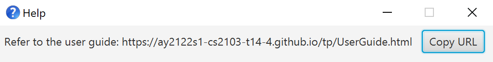
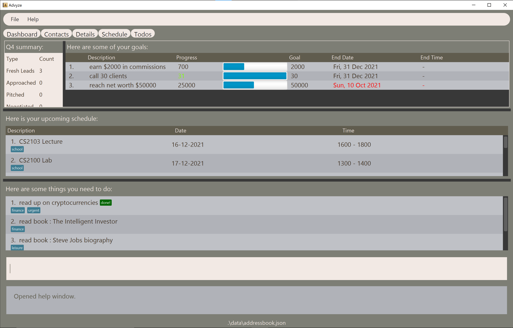
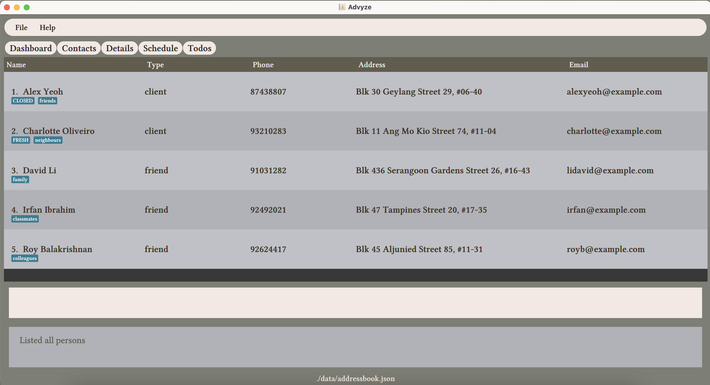
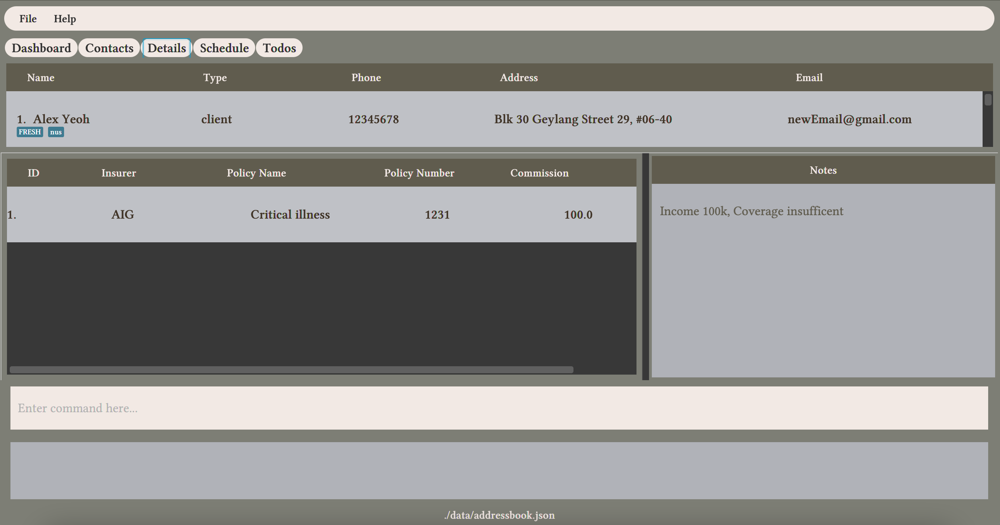
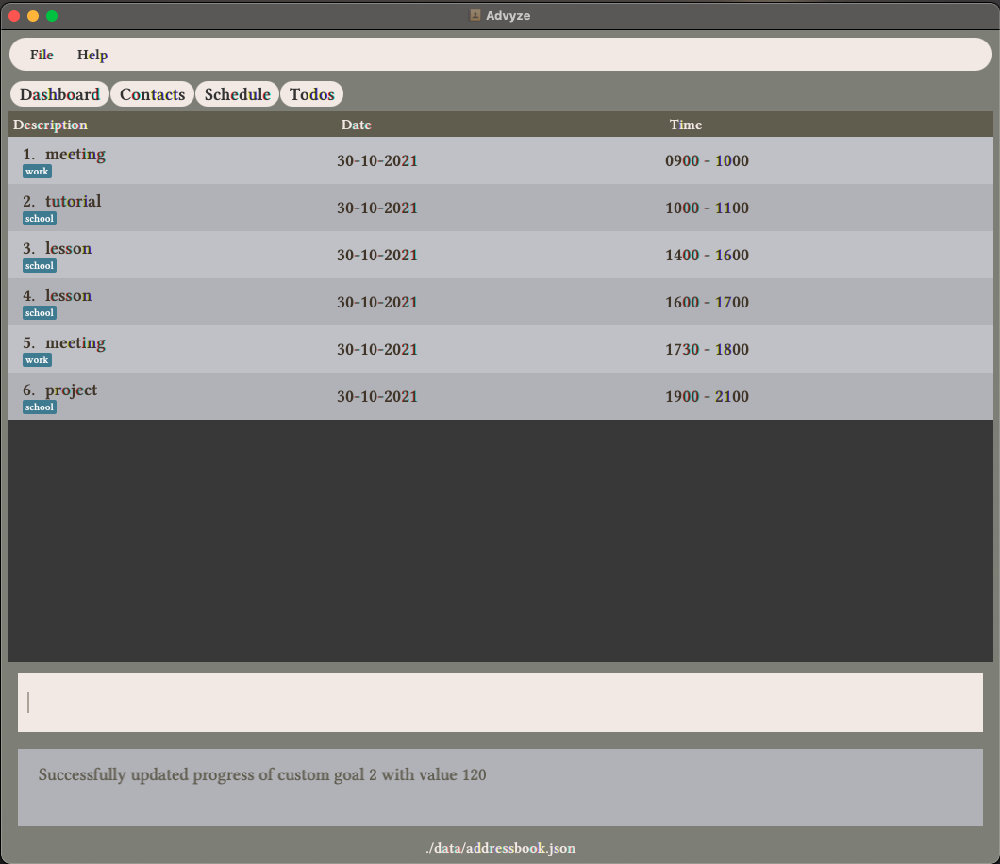

Advyze is a desktop app for tech-savvy student financial advisors to keep track of their clients and their busy school schedule, optimized for use via a Command Line Interface (CLI) while still having the benefits of a Graphical User Interface (GUI).

* Table of Contents
{:toc}

---

## Quick start

1. Ensure you have Java `11` or above installed in your Computer.

2. Download the latest `advyze.jar` release from [this link](https://github.com/AY2122S1-CS2103-T14-4/tp/releases).

3. Copy the file to the folder you want to use as the _home folder_ for Advyze.

4. Double-click the file to start the app. You should see the `dashboard` tab displayed (refer to the [Dashboard](#dashboard) to see how it is supposed to look like)

**More details coming soon**

Refer to the [Features](#Features) below for more details on what Advyze can do.

---

## Features

<div markdown="block" class="alert alert-info">

**:information_source: Notes about the command format:**<br>

-   Words in `UPPER_CASE` are the parameters to be supplied by the user.<br>
    e.g. in `add n/NAME`, `NAME` is a parameter which can be used as `add n/John Doe`.

-   Items in square brackets are optional.<br>
    e.g `n/NAME [t/TAG]` can be used as `n/John Doe t/friend` or as `n/John Doe`.

-   Items with `…`​ after them can be used multiple times including zero times.<br>
    e.g. `[t/TAG]…​` can be used as ` ` (i.e. 0 times), `t/friend`, `t/friend t/family` etc.

-   Parameters can be in any order.<br>
    e.g. if the command specifies `n/NAME p/PHONE_NUMBER`, `p/PHONE_NUMBER n/NAME` is also acceptable.

-   If a parameter is expected only once in the command, but you specified it multiple times, only the last occurrence of the parameter will be taken.<br>
    e.g. if you specify `p/12341234 p/56785678`, only `p/56785678` will be taken.

-   Extraneous parameters for commands that do not take in parameters (such as `help`, `list`, `exit` and `clear`) will be ignored.<br>
    e.g. if the command specifies `help 123`, it will be interpreted as `help`.

</div>

## General

### Viewing help : `help`

Shows a message explaning how to access the help page.



Format: `help`

### Switching between Tabs: `tab`

Format: `tab TAB_NAME`
* Switches between different tabs. Tab names are as follows:
    * dashboard
    * contacts
    * schedule
    * todos

Examples:
* `tab dashboard` while in the Contacts tab changes to the Dashboard tab
* `tab contacts` in the Contacts tab just jumps to the top of the page (returns the tab to the original landing page view)

### Convenience Commands

Allows users to input commands meant for a specific tab regardless of which tab they are currently viewing.

Format: `/TAB NAME` [command meant to run on specified TAB_NAME]

Examples:
* When in Todos tab, input `/schedule add event d/CS2103 meeting fr/1300 to/1500` will add an event in Schedule tab instead of adding it in Todos tab.
* When in Dashboard tab, input `/schedule delete 2` will remove the event at index `2` under the Schedule tab.
* When in Schedule tab, input `/schedule delete 2` and `delete 2` produces the same effect, removing the event at index `2` under the Schedule tab.

### Importing Schedule

Allows users to import `.ics` files, similar to importing timetable from NUSMods into Google Calendars.

Example:
* In any tab, input `import` will open file browser to prompt the user for a `.ics` file.

### Exiting Application: `exit`

Terminates the application

Format: `exit`

Example:
* exit in any tabs terminates the application.

### Handling invalid commands

Handles error messages thrown by tabs (in the case of invalid commands passed to said pages control), and displays a user friendly message.

Examples:
* `/schedule create` will print the error message as such:
```
“Looks like ‘Schedule’ does not have any commands called ‘create’. Below are the available commands:
<!--error message that schedule returns-->
```

## Dashboard
The dashboard is the default landing page of the app and displays a summary of relevant information from the other sections of the app.
* The dashboard by default shows 4 sections:
  * A section that displays analytics for contacts which is updated as the user populates it with data 
  * Custom goals that can be set by the user
  * The user's schedule in chronological order (which is synced with information in the Schedule tab)
  * The user's todos, with the earliest added at the top (which is synced with the information in the Todos tab)
* These sections are automatically updated as the data in the respective tabs are changed.
* The user can adjust how much of each section is to be displayed by sliding the black bars as required.

This is how the dashboard looks like as of v1.4: 


## Analytics
The analytics section is the section at the top left of the dashboard tab, directly below the dashboard button. This feature essentially provides some analytics for
the user's contacts, specifically counting the number of clients with the various status (whether they are fresh leads, approached, closed, etc).
The tracking is by quarters of the year, e.g. if the current quarter is Q3, the analytics will only show fresh leads *for Q3*, clients approached *in Q3*, etc.

This section is automatically updated as the status of the various contacts change in the contacts list. For more details about the various client statuses, see the contacts section below.


## Custom Goals
As a financial advisor, some things that they might want to set a target for and subsequently work towards include:
* The amount of commission earned in the current month/quarter
* The number of new clients called today  

Essentially, this feature set is meant for users to track anything that is quantifiable that they want to track. Every custom goal
will *minimally* have a description, a goal value, and a progress value, the former 2 which have to be specified by the user at the 
point of addition, with the progress value being set by default to 0.

To better understand how it is meant to work, if the user, for example, has a goal to call at least 20 new clients by the end of this week:
1. They would first `add` that goal, with the description being something like "call 20 clients", the goal being "20", and the end date the date of the last day of this week
2. Every time they make a new call, they would `update` the progress of that custom goal they created in step 1 by a value of 1
3. The progress bar in between the progress and goal columns gives the user a quick visual indication of how much they have accomplished / have yet to accomplish
4. Once they have hit their goal, i.e. progress >= 20, the value in the progress column would turn green as a visual indication of completion
5. If it is past the end of the week and progress < 20, the value in the end date and end time columns will turn red
6. Once the user has no need to track the goal anymore, they can `delete` it to de-clutter the space

See the subsequent sections to find out how the user could go about doing this.


### Adding a Custom Goal: `add`
Adds a new custom goal.  

Format: `add d/DESCRIPTION goal/GOAL [bydate/END_DATE] [bytime/END_TIME]`  

Note: `GOAL` has to be a number (greater than 0), `END_DATE` has to be in the format dd-mm-yyyy and `END_TIME` has to have the format
hhmm in 24-hour format. If `END_TIME` is specified, `END_DATE` has to be specified as well.  

Examples:
* Goal with a date but no time: `add d/call 20 clients goal/20 bydate/16-05-2021`
* Goal with both a date and time: `add d/earn $1000 in commissions goal/1000 bydate/23-07-2021 bytime/1200`

> :exclamation: Note: currently there is no command to edit custom goals; if the user, for example, commits a typo when entering
> information for a custom goal, they have to delete the custom goal and repeat the adding process with the intended information.

### Updating the progress of a Custom Goal: `update`

Format: `update INDEX_OF_CUSTOM_GOAL val/AMOUNT_TO_INCREMENT_GOAL_BY`

Note: `AMOUNT_TO_INCREMENT_GOAL_BY` has to be a number (can be positive or negative).  

Updates *the progress* of a particular custom goal by the specified value, i.e. updated progress = old progress + 
`AMOUNT_TO_INCREMENT_GOAL_BY`

Example: 
* To update progress of custom goal 1 by 123.4: `update 1 val/123.4`

> :bulb: Tip: since the update command allows the user to enter negative values, if they, for example, enter a wrong (positive) value
> for progress, they can correct it by updating the same goal with the difference, e.g. if the intended amount was to add 5 to progress
> but the user specified 7, they can just correct this by updating the same goal with val = -2.
  
### Deleting a Custom Goal: `delete`
Deletes the specified Custom Goal from the dashboard.  

Format: `delete INDEX_OF_GOAL_TO_DELETE`


## Contacts


### Viewing all contacts: `list`  
Format: `list`  
* Restores the contacts tab to its default view
* Contacts are listed in alphabetical order of their names
* Using `list` in details tab will also show full list of contacts

### Adding a contact: `add`
Format: `add n/NAME r/RELATIONSHIP p/PHONE e/EMAIL a/ADDRESS [t/TAG]`

Note:  
* Only supports adding relationships "friend" and "client" in v1.3
* Tags can be at most 50 characters
* Add a contact as a client to add policies and notes  
* Learn how to add notes to contacts [here](#adding-a-note-to-a-contact-note)

Examples:  
* Adding a friend: `add n/bobby r/friend p/12345678 e/example@gmail.com a/NUS`
* Adding a client: `add n/bob r/client p/12345678 e/example@gmail.com a/Heng Mui Kiat Street 32`
* Adding a friend with 2 tags: `add n/darren r/friend p/12345678 e/example@gmail.com a/Heng Mui Kiat Street 32 t/classmate t/SOC`  

### Editing a contact: `edit`
Format: `edit INDEX [n/NAME] [r/RELATIONSHIP] [p/PHONE] [e/EMAIL] [a/ADDRESS] [t/TAG]`  
Edits the contact at the specified INDEX.
* The index refers to the index number shown in the Contact list.
* The index must be a positive integer 1, 2, 3, … and a valid index in the contact list

Examples:  
Changing a friend to a client: `edit 1 r/client`  
Changing a contact's phone and email: `edit 1 p/12345678 e/newEmail@gmail.com`  
Changing a contact's tags: `edit 2 t/nus t/dancer`

### Client Status: `status`
  
Format: `status INDEX STATUS`  
Every client has a status that shows which stage in the sales process each client is in right now.
Status look like tags but have a dark blue background as show in the image above.
The valid statuses are: [fresh, approached, pitched, negotiated, closed, lost]  
* New contacts created in the contacts list are given a "fresh" status to signify that the client is a fresh lead.
* A summary of all client's statuses is shown in the [dashboard](#Dashboard) tab
* Friends do not have statuses

Examples of changing status:  
* `status 1 approached`
* `status 2 lost`

### Deleting a contact: `delete`
Format: `delete INDEX`  
Deletes the contact at the specified INDEX.  
* The index refers to the index number shown in the Contact list.
* The index must be a positive integer 1, 2, 3, … and a valid index in the contact list

Example:  
`delete 2`

### Filtering contact according to attributes: `filter`
Format: `filter [n/NAME] [r/RELATIONSHIP] [p/PHONE] [e/EMAIL] [a/ADDRESS] [t/TAG]`  
Filter all persons according to their attributes (case-insensitive) and displays them as a list with index numbers.
* Multiple filters are supported
  * Example: `filter r/client e/@gmail` 
    * Filters for all clients that has the keyword: "gmail" in their email
* Multiple keywords are supported
  * Example: `filter n/Alex Charlotte`
    * Filters all clients with names Alex OR Charlotte
* Filter for attribute: name must match whole word
  * All other attributes are simple keyword matches

  

## Details  

### Viewing a contact's policies and notes
You can view a contact's policies and notes by using the details tab: `tab details`

### Selecting a contact to view details: `select`  
Format: `select INDEX`  
Selects a contact at the specified INDEX to view policies and notes
* The index refers to the index number shown in the Contact list.
* The index must be a positive integer 1, 2, 3, … and a valid index in the contact list

Example: `select 2`

### Adding a policy to a contact: `policy`
Format: `policy INDEX insurer/INSURER num/POLICY_NUMBER n/POLICY_NAME comm/COMMISSION`  
Add a policy to a contact at the specified INDEX  show in the Contact list  
Example:  
`policy 1 insurer/AIG num/1231 n/Critical illness comm/100`

### Adding a note to a contact: `note`
Format: `note INDEX MESSAGE`
Add a note to a contact at the specified INDEX show in the Contact list  
Example:  
`note 1 Income 100k, Coverage insufficent`


### Deleting a note from a contact: `Coming Soon`
### Deleting a policy from a contact: `Coming Soon`

## Scheduling an Event

### Displaying of Events

By default, the Schedule Tabs will **ONLY** show upcoming Events. If you would like to display all the Events in the database or show only the past events, we have the following commands to customise the your Schedule Tab.

### View all events: `list`

Shows all the added Events

* Events will be ordered by date, then the order of time on that day itself

### View all upcoming events: `showupcoming`

Shows all the upcoming Events

* Upcoming Events will be ordered by date, then the order of time on that day itself

### View all upcoming events: `showpast`

Shows all the past Events

* Past Events will be ordered by date, then the order of time on that day itself

### Add Event command: `add`

Format: `add [type] [d/TASK DESCRIPTION] [date/DATE] [from/TIME FROM] [to/TIME TO] [t/TAGS] ([recurd/DATE] or [recurw/DATE] or [recury/DATE])`

 * recurd/DATE Event recurring daily till the given date
 * recurw/DATE Event recurring weekly till the given date
 * recury/DATE Event recurring yearly till the given date

Here are some of the examples to use the command lines.

 * Adding a schedule which recur daily: `add d/lesson date/16-05-2021 fr/1400 to/1600 t/important recurd/18-05-2021`
 * Adding a schedule which recur weekly: `add d/meeting date/18-05-2021 fr/1600 to/1800 t/priority recurw/15-08-2021`

**Note:** While adding an Event, it will check if the Event given has any clashes with other Events which have already been added. The Event will be added only if there is no clash in timing with other Events which are already in the list. This applies to the recurring Event as well, if there are clashes in any of the given recurring Events, it will consider the Event as a clash, and will not proceed to adding any Events.

Next, only upcoming Events will be shown. Events which happened in the past will be stored in the database, but will not be shown in the user interface.

### Edit Event command: `edit`

Edits the Event which has the respective INDEX given by the user.

Format: `edit [INDEX] [d/TASK DESCRIPTION] [date/DATE] [from/TIME FROM] [to/TIME TO] [t/TAGS]`  

Here are some of the examples to use the command lines.

 * `Editing a tag in schedule: edit 1 t/important`
 * `Editing a description and date in a schedule: edit 2 d/meeting date/18-05-2021`

**Note:** It is not compulsory to include all fields. Only include those fields which you would like to edit.

### Delete Event command: `delete`

Deletes the Event which has the respective INDEX given by the user.

Format: `delete [INDEX]`

* Deletes an event at the specified INDEX.
* The index refers to the index number shown in the Event list.
* The index must be a positive integer 1, 2, 3, ...

*Potential enhancement: to delete multiple Events at once which was already added into the Schedule.*

### Find Event command: `find`

Find the Event which has the specified keyword in the description

Format: `find [keyword]`

 * Finds Events that carries the given keyword in the description
 * Events that have the keyword will be displayed in the user interface
 * Events that does not have the keyword will not be displayed

### Filter Event command: `filter`

Filters the Event according to the keywords in any of the attributes.

Format: `filter [d/TASK DESCRIPTION] [date/DATE] [fr/TIME FROM] [to/TIME TO] [date/DATE] [t/TAGS]`

Here are some of the examples to use the command lines.

 * Filtering a tag in schedule: `filter t/important`
 * Filter based on a description and date in a schedule: `filter d/meeting date/18-05-2021`

**Note:** It is not compulsory to include all fields. Only include those fields which you would like to filter.



## Todos

### Adding a Todo while on the Todos tab : `add`

Adds a Todo that will be displayed on the Dashboard and the Todos tabs.

Format: `add d/DESCRIPTION [t/TAG]...`

* The description must not be more than 70 characters in length.
* A Todo can have any number of tags (including 0)

Examples:
* `add d/read book`
* `add d/buy new jeans t/urgent t/shopping`

### Listing all Todos while on the Todos tab : `list`

Shows a list of all Todos.

Format: `list`

* The list is sorted in chronological order, according to the time at which the Todo was created.
* By default, the list of all Todos will be shown upon navigating to the Todos tab.

### Editing a Todo while on the Todos tab : `edit`

Edits an existing Todo.

Format: `edit INDEX [d/DESCRIPTION] [t/TAG]…​`

* Edits the Todo at the specified `INDEX`. The index refers to the index number shown in the displayed Todos list. The index **must be a positive integer** 1, 2, 3, …​
* At least one of the optional fields must be provided.
* Existing values will be updated to the input values.
* When editing tags, the existing tags of the Todo will be removed i.e adding of tags is not cumulative.
* You can remove all the Todo’s tags by typing `t/` without
  specifying any tags after it.

Examples:
*  `edit 1 d/Read The Intelligent Investor` Edits the description of the 1st Todo to be `Read The Intelligent Investor`.
*  `edit 2 d/Travel to Germany t/` Edits the description of the 2nd Todo to be `Travel to Germany` and clears all existing tags.

### Marking a Todo as done while on the Todos tab : `done`

Marks the specified Todo as done.

* Marks the Todo at the specified `INDEX` as done.
* The index refers to the index number shown in the displayed Todos list.
* The index **must be a positive integer** 1, 2, 3, …​

Examples:
* `list` followed by `done 3` marks the 3rd Todo in the displayed Todos list as done.
* `filter d/book` followed by `done 1` marks the 1st Todo in the results of the `filter` command as done.

### Searching Todos by description while on the Todos tab : `find`

Finds Todos whose descriptions contain any of the given keywords.

Format: `find KEYWORD [MORE_KEYWORDS]`

* The search is case-insensitive. e.g `read book` will match `Read Book`
* The order of the keywords does not matter. e.g. `Book Read` will match `Read Book`
* Only the description is searched.
* Only full words will be matched e.g. `rea` will not match `read`
* Todos matching at least one keyword will be returned (i.e. `OR` search). e.g. `Read Buy` will return `Read Book`, `Buy Jeans`

Examples:
* `find book` returns all Todos with `book` in its description, i.e. `read book` and `return book`
* `find book buy` returns all Todos with `book`, `buy`, or `book buy` in its description, i.e. `read book` and `buy jeans`

### Filtering Todos by attributes while on the Todos tab : `filter`

Filters Todos according to any of its attributes (description, tags, and whether it is marked as done).

Format: `filter [d/DESCRIPTION KEYWORDS]... [t/TAG KEYWORDS]... [done/yes OR done/no]`

* The keywords are case-insensitive. e.g `read book` will match `Read Book`
* The order of the keywords does not matter. e.g. `Book Read` will match `Read Book`
* Only full words will be matched e.g. `rea` will not match `read`
* At least one of the optional fields must be provided, i.e. you must filter by 1 or more attributes.

Examples:
* `filter d/book` returns all Todos with `book` in its description, i.e. `read book` and `return book`
* `filter d/book done/yes` returns all Todos with `book` in its description and are marked as done, i.e. `read book`
* `filter t/learning d/read book` returns all Todos with `learning` as a tag and `read book` in its description, i.e. `read book`
* `filter done/no` returns all Todos which are not marked as done.

### Deleting a Todo while on the Todos tab : `delete`

Deletes a specified Todo.

Format: `delete INDEX`

* Deletes the Todo at the specified `INDEX`.
* The index refers to the index number shown in the displayed Todos list.
* The index **must be a positive integer** 1, 2, 3, …​

Examples:
* `list` followed by `delete 3` deletes the 3rd Todo in the displayed Todos list.
* `filter d/book` followed by `delete 1` deletes the 1st Todo in the results of the `filter` command

