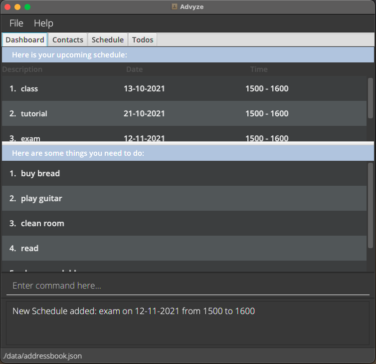
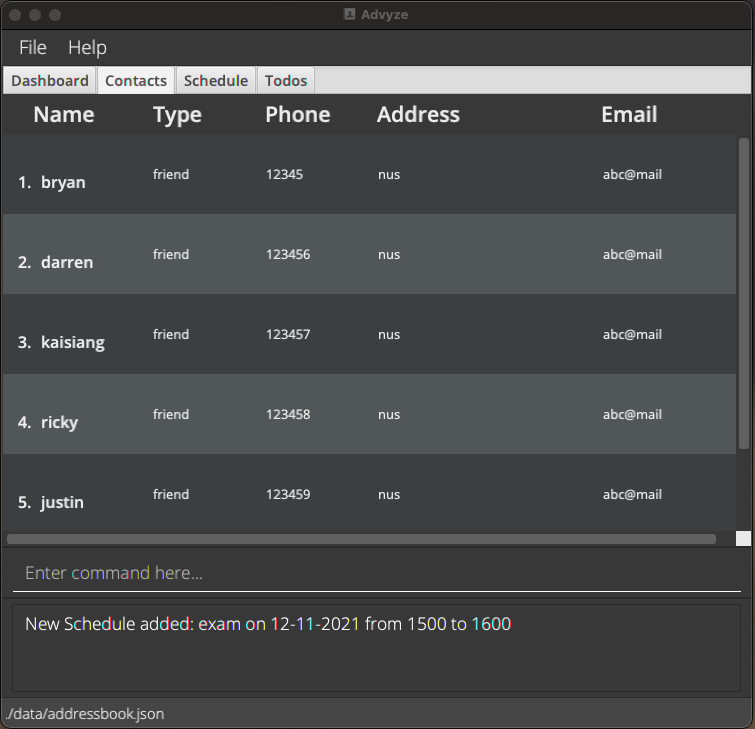
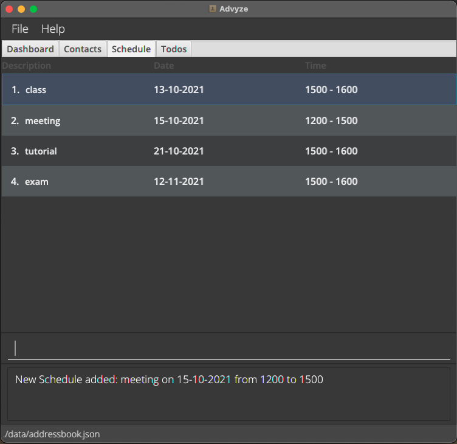

Advyze is a desktop app for tech-savvy student financial advisors to keep track of their clients and their busy school schedule, optimized for use via a Command Line Interface (CLI) while still having the benefits of a Graphical User Interface (GUI).

-   Table of Contents
    {:toc}

---

## Quick start

1. Ensure you have Java `11` or above installed in your Computer.

2. Download the latest `advyze.jar` release from [this link](https://github.com/AY2122S1-CS2103-T14-4/tp/releases).

3. Copy the file to the folder you want to use as the _home folder_ for Advyze.

4. Double-click the file to start the app. You should see the `dashboard` tab displayed (refer to the [Dashboard](#dashboard) to see how it is supposed to look like)

**More details coming soon**

Refer to the [Features](#Features) below for more details on what Advyze can do.

---

## Features

<div markdown="block" class="alert alert-info">

**:information_source: Notes about the command format:**<br>

-   Words in `UPPER_CASE` are the parameters to be supplied by the user.<br>
    e.g. in `add n/NAME`, `NAME` is a parameter which can be used as `add n/John Doe`.

-   Items in square brackets are optional.<br>
    e.g `n/NAME [t/TAG]` can be used as `n/John Doe t/friend` or as `n/John Doe`.

-   Items with `…`​ after them can be used multiple times including zero times.<br>
    e.g. `[t/TAG]…​` can be used as ` ` (i.e. 0 times), `t/friend`, `t/friend t/family` etc.

-   Parameters can be in any order.<br>
    e.g. if the command specifies `n/NAME p/PHONE_NUMBER`, `p/PHONE_NUMBER n/NAME` is also acceptable.

-   If a parameter is expected only once in the command, but you specified it multiple times, only the last occurrence of the parameter will be taken.<br>
    e.g. if you specify `p/12341234 p/56785678`, only `p/56785678` will be taken.

-   Extraneous parameters for commands that do not take in parameters (such as `help`, `list`, `exit` and `clear`) will be ignored.<br>
    e.g. if the command specifies `help 123`, it will be interpreted as `help`.

</div>

## Dashboard
The dashboard is the default landing page of the app and displays a summary of relevant information from the other sections of the app.
* The dashboard by default shows:
  * The user's schedule in chronological order
  * The user's todos, with the earliest added at the top
* These sections are automatically updated as the data in the respective tabs are changed.
* The user can adjust how much of each section is to be displayed by sliding the white horizontal bar up and down.
* In future versions, the user will be able to customise what they wish to see on the dashboard.

This is how the dashboard looks like as of v1.2: 


### Customising the dashboard
Allows the user to customise what to display on the dashboard. More details coming soon.


## Contacts


### Viewing all contacts: `list`  
Format: `list`  
* Restores the contacts tab to its default view
* Contacts are listed in alphabetical order of their names

### Adding a contact: `add`
Format: `add n/NAME r/RELATIONSHIP p/PHONE e/EMAIL a/ADDRESS [t/TAG]`

Note:  
Only supports adding relationships "friend" and "client" in v1.2  

Examples:  
* Adding a friend: `add n/bobby r/friend p/12345678 e/example@gmail.com a/NUS`
* Adding a client: `add n/bob r/client p/12345678 e/example@gmail.com a/Heng Mui Kiat Street 32`

### Deleting a contact: `delete`
Format: `delete INDEX`  
Deletes the contact at the specified INDEX.  
* The index refers to the index number shown in the Contact list.
* The index must be a positive integer 1, 2, 3, … and a valid index in the contact list

Example:  
`delete 2`  




## Scheduling an Event

### View all events: `list`

Shows all the added Events

-   Events are first ordered by date, then the order of time on that day itself

### Add Event command: `add`

Format: `[type] [d/TASK DESCRIPTION] [from/TIME FROM] [to/TIME TO] OR [due/DUE DATE]`

Here are some of the examples to use the command lines.

-   `Adding a schedule: add event d/CS2103 meeting from/1300 to/1500`
-   `Adding a deadline: add event d/sign contract (Bob) due/21-09-2021`

Note: While adding an Event, it will check if the Event given has any clashes with other Events which have already been added. The Event will be added only if there is no clash in timing with other Events which are already in the list.

### Delete Event command: `delete`

Deletes the Event which has the respective INDEX given by the user.

Format: `delete [INDEX]`

-   Deletes an event at the specified INDEX.
-   The index refers to the index number shown in the Event list.
-   The index must be a positive integer 1, 2, 3, ...



## Todos

### Listing all Todos : `list`

Shows a list of all Todos.

Format: `list`

* The list is sorted in chronological order, according to the time at which the Todo was created.
* By default, the list of all Todos will be shown upon navigating to the Todos tab.

### Adding a Todo while on the Todo tab : `add`

Adds a Todo that will be displayed on the Dashboard and the Todos tabs.

Format: `add d/DESCRIPTION`

Examples:
* `add d/read book`
* `add d/buy new jeans`

### Deleting a Todo while on the Todo tab : `delete`

Deletes a specified Todo.

Format: `delete INDEX`

* Deletes the Todo at the specified `INDEX`.
* The index refers to the index number shown in the displayed Todos list.
* The index **must be a positive integer** 1, 2, 3, …​

Examples:
* `list` followed by `delete 3` deletes the 3rd Todo in the displayed Todos list.

## General

### Switching between Tabs: `tab`

Format: `tab /TAB NAME`
* Switches between different tabs. Tab names are as follows:
    * dashboard
    * contacts
    * schedule
    * todos

Examples:
* `tab dashboard` while in the Contacts tab changes to the Dashboard tab
* `tab contacts` in the Contacts tab just jumps to the top of the page (returns the tab to the original landing page view)

### Convenience Commands (not supported yet as of v1.2)

Allows users to input commands meant for a specific tab regardless of which tab they are currently viewing.

Format: [commands listed by other functionalities]

Examples:
* When in Todos tab, input `/schedule add event des/CS2103 meeting from/1300 to/1500` will add an event in Schedule tab instead of adding it in Todos tab.
* When in Dashboard tab, input `/schedule delete 2` will remove the event at index `2` under the Schedule tab.
* When in Schedule tab, input `/schedule delete 2` and `delete 2` produces the same effect, removing the event at index `2` under the Schedule tab.

### Exiting Application: `exit`

Terminates the application

Format: `exit`

Example:
* exit in any tabs terminates the application.

### Handling invalid commands

Handles error messages thrown by tabs (in the case of invalid commands passed to said pages control), and displays a user friendly message.

Examples:
* `/schedule create` will print the error message as such:
```
“Looks like ‘Schedule’ does not have any commands called ‘create’. Below are the available commands:
<!--error message that schedule returns-->
```

