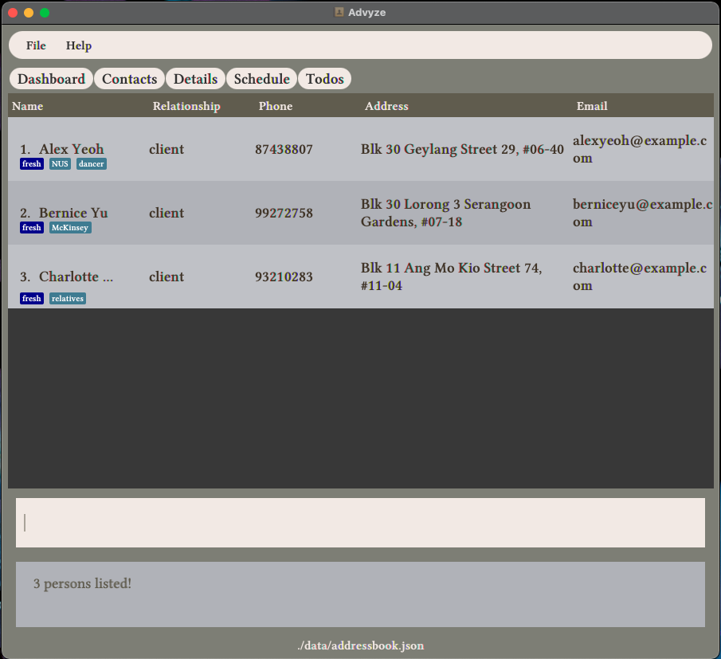
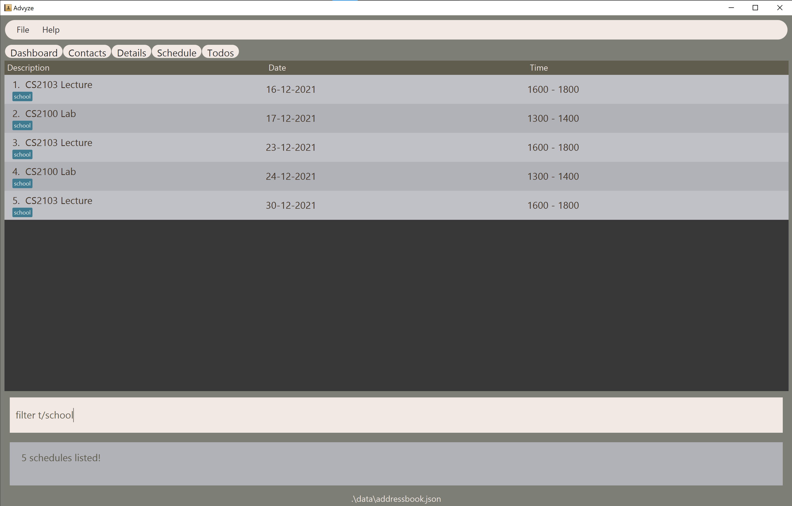

Advyze is a desktop app for tech-savvy student financial advisors to keep track of their clients and their busy school schedule, optimized for use via a Command Line Interface (CLI) while still having the benefits of a Graphical User Interface (GUI).

* Table of Contents
{:toc}

---

## Quick Start

1. Ensure you have Java `11` or above installed in your computer.
2. Download the latest `advyze.jar` release from [this link](https://github.com/AY2122S1-CS2103-T14-4/tp/releases).
3. Copy the file to the folder you want to use as the _home folder_ for Advyze.
4. Double-click the file to start the app. You should see the Dashboard tab displayed (refer to the [Dashboard tab](#dashboard-tab) section to see how it is supposed to look like).
5. At this point, you are good to go! You can now begin running the commands detailed in this guide for any of the tabs.

---

## Using This Guide

This guide is sectioned by tabs. Under the sections for each tab, the reader will find information regarding the commands that can be ran on that tab specifically, as well as a brief description of the intended purpose of the tab. In addition, there is a general section that explains commands that are not tab specific, and can be ran while on any tab. There is also a command summary table at the end of this document.

> :exclamation: Note: 
>
> The commands described in the various tab specific sections (Dashboard tab, Todos tab etc) are only meant to run as intended when the user is on the correct tab. This means that if some command X with effect Y is specified in the 'Z tab' section, the user will only get intended effect Y when X is executed *when on the Z tab* (unless the user uses [convenience commands](#convenience-commands), or if it is the Contacts and Details tabs which are highly related, see [Summary of commands for Contacts and Details tab](#Summary-of-commands-for-Contacts-and-Details-tab)). For example, the command to mark a todo as done will work only while the user is on the Todos tab.
>
> It is hence implied that any command in the tab-specific sections describes the behaviour when running that command when on that tab in particular.

**:information_source: Notes about the command format:** 

-   Words in `UPPER_CASE` are the parameters to be supplied by the user. 
    e.g. in `add n/NAME`, `NAME` is a parameter which can be used as `add n/John Doe`.

-   Items in square brackets are optional. 
    e.g `n/NAME [t/TAG]` can be used as `n/John Doe t/friend` or as `n/John Doe`.

-   Items with `…`​ after them can be used multiple times including zero times. 
    e.g. `[t/TAG]…​` can be used as ` ` (i.e. 0 times), `t/friend`, `t/friend t/family` etc.

-   Parameters can be in any order. 
    e.g. if the command specifies `n/NAME p/PHONE_NUMBER`, `p/PHONE_NUMBER n/NAME` is also acceptable.

-   If a parameter is expected only once in the command, but you specified it multiple times, only the last occurrence of the parameter will be taken. 
    e.g. if you specify `p/12341234 p/56785678`, only `p/56785678` will be taken.

-   Extraneous parameters for commands that do not take in parameters (such as `help`, `list`, `exit` and `clear`) will be ignored. 
    e.g. if the command specifies `help 123`, it will be interpreted as `help`.

## General Commands

> :exclamation: All the commands in this section can be ran while on any tab.

### Viewing help : `help`

Shows a message explaining how to access the help page.

Format: `help`

### Switching between tabs: `tab`

Switches between different tabs.

Format: `tab TAB_NAME`

> :bulb: Tip: the various `TAB_NAME`s are:
>
> * dashboard
> * contacts
> * details
> * schedule
> * todos

Examples:
* `tab dashboard` while on the Contacts tab changes to the Dashboard tab
* `tab contacts` while on the Contacts tab has no effect – the user just remains on the Contacts tab

### Convenience commands

To prevent extra tab switches in order to execute commands, convenience commands allows users to execute commands meant for some other tab regardless of which tab they are currently on.

Format: `/TAB NAME` [command meant to run on specified TAB_NAME] 

(see the :bulb: tip under the "Switching between Tabs" section above for the various `TAB_NAME`s)

Examples:
* When on Todos tab, input `/schedule add d/CS2103 Meeting date/20-12-2021 fr/1300 to/1500` will add a new event (akin to executing the `add` command on the Schedule tab) instead of adding a new todo.
* When in Dashboard tab, input `/schedule delete 2` will remove the event at index `2` on the Schedule tab.
* When in Schedule tab, input `/schedule delete 2` and `delete 2` produces the same effect, removing the event at index `2` on the Schedule tab.

### Importing .ics files for schedule: `import`

Allows users to import `.ics` files, similar to importing timetable from NUSMods into Google Calendars.

Format: import

Example:
* On any tab, executing `import` will open the file browser for the user to select the `.ics` file to import.

### Exiting the application: `exit`

Terminates the application.

Format: `exit`

## Dashboard Tab
The Dashboard tab is the default landing page of the app. It displays a summary of relevant information from the other sections of the app in addition to having some features of its own.
* The Dashboard tab by default has 4 sections:
  * The analytics for contacts, which is automatically updated as the user populates the app with data (top left)
  * The user's custom goals, which they can add and update (top right)
  * The user's schedule in chronological order (which is synced with information in the Schedule tab) (middle)
  * The user's todos, with the earliest added at the top (which is synced with the information in the Todos tab) (bottom)
* These sections are automatically updated as the data in the respective tabs are changed.
* The user can adjust how much of each section is to be displayed by sliding the black bars up and down or left and right as required.

This is how the Dashboard tab looks like as of v1.4: 

### Analytics
The analytics section is the section at the top left of the Dashboard tab, directly below the Dashboard button. This feature provides some analytics for the user's contacts, specifically counting the number of clients with the various `status` (whether they are fresh leads, approached, closed, etc).

The tracking is by quarters of the year, e.g. if the current quarter is Q3, the analytics will only show fresh leads *for Q3*, clients approached *in Q3*, etc.

This section is automatically updated as the status of the various contacts change in the contacts list. For more details about the various client statuses, see the contacts section below.

### Custom Goals
As a financial advisor, they might want to set a target for and subsequently work towards things like:
* The amount of commission earned in the current month/quarter
* The number of new clients called today  

Essentially, this feature set is meant for users to track anything that is quantifiable that they want to track. Every custom goal will *minimally* have a description, a goal value, and a progress value, the former 2 which have to be specified by the user at the point of addition, with the progress value being set by default to 0.

To better understand how this is meant to work, if the user, for example, has a goal to call at least 20 new clients by the end of this week:
1. They would first `add` that goal, with the description being something like "call 20 clients", the goal being "20", and the end date the date of the last day of this week
2. Every time they make a new call, they would `update` the progress of that custom goal they created in step 1 by a value of 1
3. The progress bar in between the progress and goal columns gives the user a quick visual indication of how much they have accomplished / have yet to accomplish
4. Once they have hit their goal, i.e. progress >= 20, the value in the progress column would turn green as a visual indication of completion
5. If it is past the end of the week and progress < 20, the value in the end date and end time columns will turn red
6. Once the user has no need to track the goal anymore, they can `delete` it to de-clutter the space

See the subsequent sections to find out how the user could go about doing this.

#### Adding a custom goal: `add`
Adds a new custom goal.  

Format: `add d/DESCRIPTION goal/GOAL [bydate/END_DATE] [bytime/END_TIME]`  

> :exclamation: Note: `GOAL` has to be a number (greater than 0), `END_DATE` has to be in the format dd-mm-yyyy and `END_TIME` has to have the format hhmm in 24-hour format. If `END_TIME` is specified, `END_DATE` has to be specified as well.  

Examples:
* Adding a goal with a date but no time: `add d/call 20 clients goal/20 bydate/16-05-2022`
* Adding a goal with both a date and time: `add d/earn $1000 in commissions goal/1000 bydate/23-07-2022 bytime/1200`

> :exclamation: Note: currently there is no command to edit custom goals; if the user, for example, commits a typo when creating a custom goal, they have to delete the custom goal and repeat the adding process with the correct information.

#### Updating the progress of a custom goal: `update`

Updates *the progress* of a particular custom goal by the specified value, i.e. updated progress = old progress + `AMOUNT_TO_INCREMENT_GOAL_BY`

Format: `update INDEX_OF_CUSTOM_GOAL val/AMOUNT_TO_INCREMENT_GOAL_BY`

* `AMOUNT_TO_INCREMENT_GOAL_BY` has to be a number (can be positive or negative)

Example: 
* To update progress of custom goal 1 by an amount of 123.4: `update 1 val/123.4`

> :bulb: Tip: since the update command allows the user to enter negative values, if they, for example, enter a wrong (positive) value for progress, they can correct it by updating the same goal with the difference, e.g. if the intended amount was to add 5 to progress but the user specified 7, they can just correct this by updating the same goal and specifying val = -2.

#### Deleting a custom goal: `delete`
Deletes the specified Custom Goal from the Dashboard.  

Format: `delete INDEX_OF_GOAL_TO_DELETE` 

* `INDEX_OF_GOAL_TO_DELETE` has to be a valid index

## Contacts Tab

This tab contains all the user's added contacts and their information.

### Viewing all contacts: `list`  
Restores the contacts tab to its default view

Format: `list`  

* Using `list` in Details tab will also show full list of contacts

### Adding a contact: `add`

Adds a new contact into the list of all contacts.

Format: `add n/NAME r/RELATIONSHIP p/PHONE e/EMAIL a/ADDRESS [t/TAG]`

* Tags can be at most 50 characters

* A contact can either have a relationship `client` or `friend`
* Policies can only be added for clients, add a contact with the argument `r/client` to add policies to that contact
* Learn how to add notes for contacts [here](#adding-a-note-to-a-contact-note)
* Learn how to add policies for clients [here](#adding-a-policy-to-a-contact-policy)

Examples:  
* Adding a friend: `add n/bobby r/friend p/12345678 e/example@gmail.com a/NUS`
* Adding a client: `add n/bob r/client p/12345678 e/example@gmail.com a/Heng Mui Kiat Street 32`
* Adding a friend with 2 tags: `add n/darren r/friend p/12345678 e/example@gmail.com a/Heng Mui Kiat Street 32 t/classmate t/SOC`  

### Editing a contact: `edit`

Edits an existing contact.

Format: `edit INDEX [n/NAME] [r/RELATIONSHIP] [p/PHONE] [e/EMAIL] [a/ADDRESS] [t/TAG]`  
* The index refers to the contact's index number shown on the Contacts tab
* The index must be a positive integer 1, 2, 3, … and a valid index in the contact list

Examples:  

* Changing a friend to a client: `edit 1 r/client`  
* Changing a contact's phone and email: `edit 1 p/12345678 e/newEmail@gmail.com`  
* Changing a contact's tags: `edit 2 t/nus t/dancer`

### Deleting a contact: `delete`

Deletes the contact at a specified `INDEX`.  

Format: `delete INDEX`  

* The index refers to the contact's index number shown on the Contacts tab

Example:  

* Delete contact 2: `delete 2`

### Filtering contacts: `filter`

Filters all contacts according to specified attributes (case-insensitive) and displays them as a list with index numbers.

Format: `filter [n/NAME] [r/RELATIONSHIP] [p/PHONE] [e/EMAIL] [a/ADDRESS] [t/TAG]`  

* Multiple filters are supported
  * Example: `filter r/client e/@gmail` 
    * Filters for all clients that has the keyword: "@gmail" in their email
* Multiple keywords are supported
  * Example: `filter n/Alex Charlotte`
    * Filters all clients with names Alex OR Charlotte
* Filtering by name only shows whole-word matches
  * All other attributes are simple keyword matches

Expected result of `filter r/client`:
  

## Details Tab

This tab allows the user to view detailed policy information and notes for their clients.

> :bulb: Note: the Details tab and Contacts tab have some overlapping commands, i.e. there are some commands that can be ran on both the Details and Contacts tabs. See the [Summary of commands for Contacts and Details tab](#Summary-of-commands-for-Contacts-and-Details-tab) for more details.

### Selecting a contact to view their details: `select`  

Selects a contact (who is a client) at a specified INDEX to view their policies and notes that you have written on them.

Format: `select INDEX`  

* The index refers to the index number shown in the contact list.
* The index must be a positive integer 1, 2, 3, … and a valid index in the contact list

Example:

* `select 2`

### Changing a client's status: `status`
  

Every client has a status that shows which stage in the sales process each client is in right now.
Statuses look like tags but have a dark blue background, as show in the image above.

The valid statuses are: [fresh, approached, pitched, negotiated, closed]

* New contacts created in the contacts list are given a "fresh" status to signify that the client is a fresh lead
* The total number of clients with a particular status is shown in the analytics section of the [Dashboard](#dashboard-tab) tab
* Friends do not have statuses

Format: `status INDEX STATUS`  

* Index is the index of the contact to change the status of
* Status is the new status to change to

Examples of changing status:
* Change status of contact 1 to "approached": `status 1 approached`
* Change status of contact 2 to "negotiated": `status 2 negotiated`

### Adding a policy to a contact: `policy`

Adds a policy to the client corresponding to the specified INDEX in the contact list.

Format: `policy INDEX insurer/INSURER num/POLICY_NUMBER n/POLICY_NAME comm/COMMISSION`  

* Commission cannot be a negative number  

* You cannot add policies to friends, but you can use the `edit` command to change the relationship of a `friend` to a `client` 

Example:  

* `policy 1 insurer/AIG num/1231 n/Critical illness comm/100.99`

### Adding a note to a contact: `note`

Adds a note to a contact at the specified INDEX as shown in the contact list.

Format: `note INDEX MESSAGE`  

Example:  

* `note 1 Income 100k, Coverage insufficent`

### Deleting a note from a contact: `coming soon`
### Deleting a policy from a contact: `coming soon`  
Deleting contact details will be implemented in future versions. For now, you can delete or edit policies and notes manually in the file `data/addressbook.json` if you made a mistake adding such client details.

### Summary of commands for Contacts and Details tab
| Command      | Format |Contacts tab | Details tab |
| ----------- | ----------- | ----------- | ---------- |
| list | `list`|:heavy_check_mark: | :heavy_check_mark:|
| add | `add n/NAME r/RELATIONSHIP p/PHONE e/EMAIL a/ADDRESS [t/TAG]`|:heavy_check_mark: | :x:|
| edit |`edit INDEX [n/NAME] [r/RELATIONSHIP] [p/PHONE] [e/EMAIL] [a/ADDRESS] [t/TAG]`| :heavy_check_mark: |:x:|
| delete |`delete INDEX`| :heavy_check_mark:|:x:|
| filter  |`filter [n/NAME] [r/RELATIONSHIP] [p/PHONE] [e/EMAIL] [a/ADDRESS] [t/TAG]`| :heavy_check_mark:|:x:|
| select   |`select INDEX` | :heavy_check_mark:|:heavy_check_mark:|
| status  |`status INDEX STATUS`  | :heavy_check_mark:|:heavy_check_mark:|
| policy   |`policy INDEX insurer/INSURER num/POLICY_NUMBER n/POLICY_NAME comm/COMMISSION`| :heavy_check_mark:|:heavy_check_mark:|
| note   |`note INDEX MESSAGE` | :heavy_check_mark:|:heavy_check_mark:|

## Schedule Tab

The Schedule tab shows all of the user's events in chronological order.

> :exclamation:Note: By default, the Schedule tab will **ONLY** show upcoming Events. The user can use some of the following commands to customise the kind of events to display.

### Viewing all events: `list`

Shows all the added Events. Events will be ordered by date, then by time.

### Viewing all upcoming events: `showupcoming` // TODO

Shows all the upcoming Events

* Upcoming Events will be ordered by date, then the order of time on that day itself

### View all upcoming events: `showpast` // TODO

Shows all the past Events

* Past Events will be ordered by date, then the order of time on that day itself

### Adding an event: `add`

Adds a new event to the schedule.

Format: `add [type] [d/TASK DESCRIPTION] [date/DATE] [from/TIME FROM] [to/TIME TO] [t/TAGS] ([recurd/DATE] or [recurw/DATE] or [recury/DATE])`

 * recurd/DATE Event recurring daily until the given date
 * recurw/DATE Event recurring weekly until the given date
 * recury/DATE Event recurring yearly until  the given date

> :exclamation: Note:
>
> * While adding an event, it will check if the event to add has any clashes with existing events. The event will only be added if there are no clashes. This applies to adding recurring events as well – if there are clashes for any of the recurring events, no events will be added at all.
> * **Only upcoming Events will be shown.** Past events will be stored in the database, but will not be displayed to the user.

Examples:

 * Adding an event which recurs daily: `add d/lesson date/16-05-2021 fr/1400 to/1600 t/important recurd/18-05-2021`
 * Adding an event which recurs weekly: `add d/meeting date/18-05-2021 fr/1600 to/1800 t/priority recurw/15-08-2021`

### Editing an existing event: `edit`

Edits the event at the specified INDEX.

Format: `edit INDEX [d/TASK DESCRIPTION] [date/DATE] [from/TIME FROM] [to/TIME TO] [t/TAGS]`  

* `INDEX` is the only compulsory field

Examples:

 * Editing the tag of event 1: `edit 1 t/important`
 * Editing the description and date of event 2: `edit 2 d/meeting date/18-05-2021`

### Filtering events: `filter`

Filters the schedule according to the specified keywords and attributes.

Format: `filter [d/TASK DESCRIPTION] [date/DATE] [fr/TIME FROM] [to/TIME TO] [date/DATE] [t/TAGS]`

Examples:

 * Filtering by tags: `filter t/important`
 * Filtering by description and date: `filter d/meeting date/18-05-2021`

Expected result of `filter t/school`:

### Deleting an event: `delete`

Deletes the event at the specified INDEX.

Format: `delete [INDEX]`

* The index refers to the index number of the event on the Schedule tab.

*Potential enhancement: to delete multiple Events at once which was already added into the schedule.*

## Todos Tab

The Todos tab shows all the user's todos.

### Listing all todos: `list`

Shows a list of all todos.

Format: `list`

* The list is sorted in chronological order, according to the time at which the todo was created.

### Adding a todo: `add`

Adds a todo.

Format: `add d/DESCRIPTION [t/TAG]...`

* The description must not be more than 70 characters in length.
* A todo can have any number of tags (including 0)
* Each tag must not be more than 50 characters in length.

Examples:
* `add d/read book`
* `add d/buy new jeans t/urgent t/shopping`

### Editing a todo: `edit`

Edits an existing todo.

Format: `edit INDEX [d/DESCRIPTION] [t/TAG]…​`

* Edits the todo at the specified `INDEX`. The index refers to the index number shown in the displayed todos list. The index **must be a positive integer** 1, 2, 3, …​
* At least one of the optional fields must be provided.
* Existing values will be updated to the input values.
* When editing tags, any existing tags of the specified todo will be removed i.e adding of tags is not cumulative.
* You can remove all the todo’s tags by typing `t/` without specifying any tags after.

Examples:
*  Edit the description of the 1st todo to be "Read The Intelligent Investor": `edit 1 d/Read The Intelligent Investor` 
*  Edit the description of the 2nd todo to be "Travel to Germany" and clear all existing tags: `edit 2 d/Travel to Germany t/` 

### Marking a todo as done: `done`

Marks the specified todo as done.

* Marks the todo at the specified `INDEX` as done.
* The index refers to the index number shown in the displayed todos list.
* The index **must be a positive integer** 1, 2, 3, …​

Examples:
* `list` followed by `done 3` marks the 3rd todo in the displayed todos list as done.
* `filter d/book` followed by `done 1` marks the 1st todo in the results of the `filter` command as done.

### Searching todos by description: `find`

Finds todos whose descriptions contain any of the given keywords.

Format: `find KEYWORD [MORE_KEYWORDS]`

* The search is case-insensitive. e.g `read book` will match `Read Book`
* The order of the keywords does not matter. e.g. `Book Read` will match `Read Book`
* Only the description is searched.
* Only full words will be matched e.g. `rea` will not match `read`
* Todos matching at least one keyword will be returned (i.e. `OR` search). e.g. `Read Buy` will return `Read Book`, `Buy Jeans`

Examples:
* `find book` returns all todos with `book` in its description, e.g. `read book` and `read book : Steve Jobs autobiography`
* `find book buy` returns all todos with `book` or `buy` in its description, e.g. `read book` and `buy new jeans`

### Filtering todos by attributes: `filter`

Filters todos according to any of its attributes (description, tags, and whether it is marked as done).

Format: `filter [d/DESCRIPTION] [t/TAG] [done/yes OR done/no]`

* The keywords are case-insensitive. e.g `read book` will match `Read Book`
* The order of the keywords does not matter. e.g. `Book Read` will match `Read Book`
* Only full words will be matched e.g. `rea` will not match `read`
* At least one of the optional fields must be provided, i.e. you must filter by 1 or more attributes.

Examples:
* `filter d/book` returns all todos with `book` in its description, e.g. `read book` and `read book : Steve Jobs autobiography`
* `filter d/book done/yes` returns all todos with `book` in its description and are marked as done
* `filter t/finance d/read` returns all todos with `finance` as a tag and `read` in its description
* `filter done/no` returns all todos which are not marked as done.

### Deleting a todo: `delete`

Deletes a specified todo.

Format: `delete INDEX`

* Deletes the todo at the specified `INDEX`.
* The index refers to the index number shown in the displayed todos list.
* The index **must be a positive integer** 1, 2, 3, …​

Examples:
* `list` followed by `delete 3` deletes the 3rd todo in the displayed todos list.
* `filter d/book` followed by `delete 1` deletes the 1st todo in the results of the `filter` command

## Command Summary

